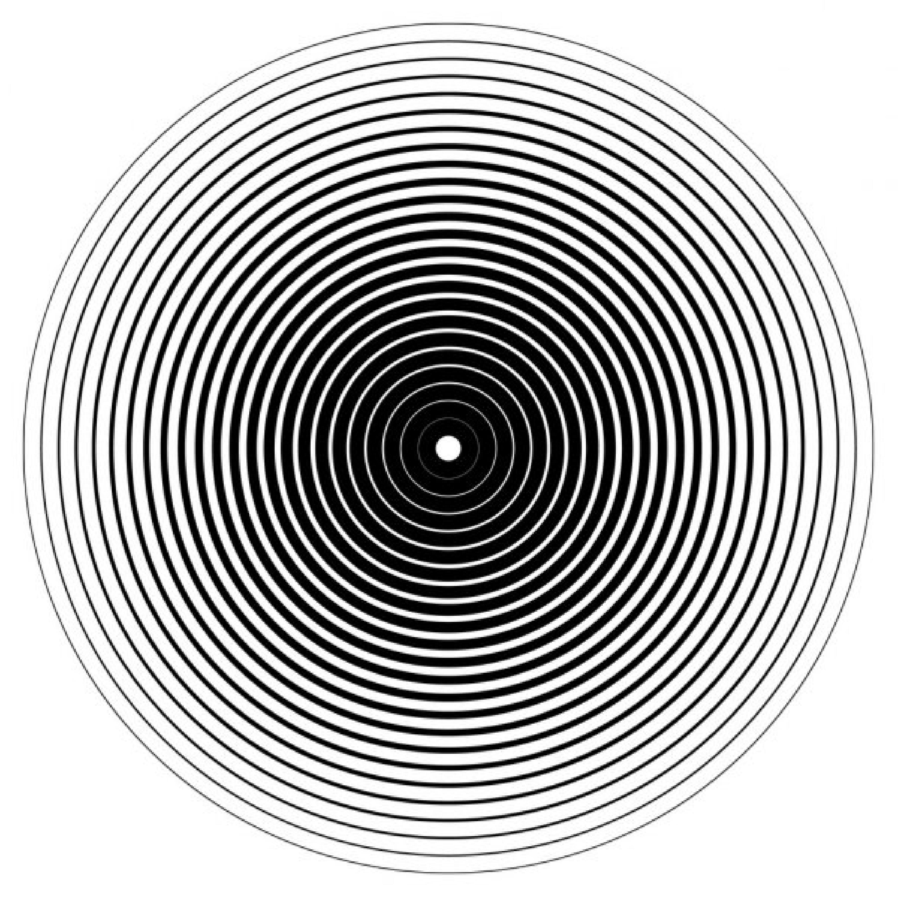
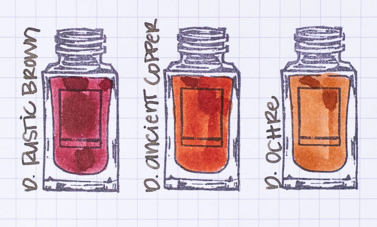

# Лабораторная работа №1

## Тема: Передискретизация, обесцвечивание и бинаризация растровых изображений

|**Студент:**|*Долидзе Александра*|
|------------|--------------|
|**Группа:** |*Б18-514*     |
|**Вариант:**|*3*           |

### 1. Передискретизация

#### 1.1 Растяжение (интерполяция) изображения в M раз

|**Исходное**|**Размер исходного**| Интерполяция х4 | Размер | Интерполяция x6 | Размер |
|------------|--------------|------------|--------------|------------|--------------|
|| 600  x  600 |  | 2400  x  2400 |  | 3600  x  3600 |
|| 757  x  456 |  | 3028  x  1824 |  | 4542  x  2736 |

#### 1.2 Сжатие (децимация) изображения в N раз

|**Исходное**|**Размер исходного**| Децимация х3 | Размер | Децимация x7 | Размер |
|------------|--------------|------------|--------------|------------|--------------|
|| 600  x  600 |  | 200  x  200 |  | 86  x  86 |
|| 757  x  456 |  | 252  x  152 |  | 108  x  65 |

#### 1.3 Передискретизация изображения в K=M/N раз путём растяжения и последующего сжатия (в два прохода)

Передискретизация изображения в K=3/2 раз за два прохода. Исходный размер `720x458` результирующий размер `1080x687`:

---

Передискретизация изображения в K=3/2 раз за два прохода. Исходный размер `720x720` результирующий размер `1080x1080`:

#### 1.4 Передискретизация изображения в K раз за один проход

Передискретизация изображения в K=3/2 раз за один проход. Исходный размер `720x458` результирующий размер `1080x687`:

---

Передискретизация изображения в K=3/2 раз за один проход. Исходный размер `720x720` результирующий размер `1080x1080`:

### 2. Приведение полноцветного изображения к полутоновому

Исходное изображение:

Результирующее изображение с обычными коэффицентами:

Результирующее изображение с коэффицентами photoshop:

---

Исходное изображение:

Результирующее изображение с обычными коэффицентами:

Результирующее изображение с коэффицентами photoshop:

### 3. Приведение полутонового изображения к монохромному методом пороговой обработки

Исходное изображение:

|**B \ K**		|					0.2								   |					0.6				    			  |					0.8                                  |
|---------------|------------------------------------------------------|------------------------------------------------------|------------------------------------------------------|
|**20** 		||||
|**40**			||||
|**80**			||||

---

Исходное изображение:

Результирующее изображение c `k = 0.2`, `b = 15`:

|**B \ K**		|					0.2									|					0.6									|					0.8                                 |
|---------------|-------------------------------------------------------|-------------------------------------------------------|-------------------------------------------------------|
|**20** 		||||
|**40**			||||
|**80**			||||
