# Лабораторная работа №2

## Тема: Фильтрация изображений и морфологические операции

|**Студент:**|*Камолов Амир*|
|------------|--------------|
|**Группа:** |*Б18-514*     |

---

## Примеры

1. [Котик - малым шума](#ex1)
2. [Котик - немного шума](#ex2)
<<<<<<< HEAD
3. [Котик - много шума](#ex3)
4. [Другой котик - немного шума](#ex4)
5. [Иероглиф](#ex5)
6. [Спираль](#ex6)
7. [Текст](#ex7)
8. [Пиксель-арт](#ex8)
=======
3. [Котик - инвертированный](#ex3)
4. [Котик - инвертированный](#ex4)
5. [Другой котик - немного шума](#ex5)
6. [Иероглиф](#ex6)
7. [Спираль](#ex7)
8. [Текст](#ex8)
9. [Пиксель-арт](#ex9)
>>>>>>> dev

## План

---

- ### Задание №1: Фильтрация медианным фильтром с ядром в виде холма (приоритет центра и соседей), в виде впадины (приоритет углов и соседей, в центре 1)

  - Ядро в виде холма

    ```
    1 2 1
    2 4 2
    1 2 1
    ```

  - Ядро в виде впадины

    ```
    4 2 4
    3 1 3
    4 2 4
    ```

- ### Задание №2: Разностное изображение (попиксельный xor или модуль разности)

<a name="ex1"> <h2>Пример №1</h2> </a>

---

- #### Исходное изображение

    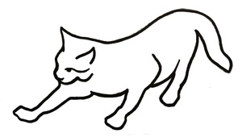

- #### Изображение с шумом и перцем

    

<<<<<<< HEAD
### Задание №1

- #### Ядро в виде холма

    

- #### Ядро в виде впадины

    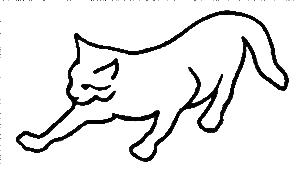

### Задание №2

- #### Разностное изображение

    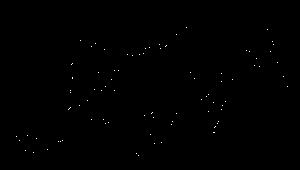
=======
### Задание

|**Xолм**|**Впадина**|**Разностное**|
|--------|-----------|--------------|
|||

>>>>>>> dev

<a name="ex2"> <h2>Пример №2</h2> </a>

---

- #### Исходное изображение

    

- #### Изображение с шумом и перцем

    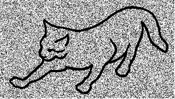

<<<<<<< HEAD
### Задание №1

- #### Ядро в виде холма

    

- #### Ядро в виде впадины

    

### Задание №2

- #### Разностное изображение

    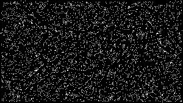
=======
### Задание

|**Xолм**|**Впадина**|**Разностное**|
|--------|-----------|--------------|
|||

>>>>>>> dev

<a name="ex3"> <h2>Пример №3</h2> </a>

---

- #### Исходное изображение

<<<<<<< HEAD
    

- #### Изображение с шумом и перцем

    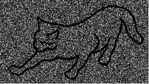

### Задание №1

- #### Ядро в виде холма

    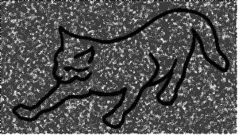

- #### Ядро в виде впадины

    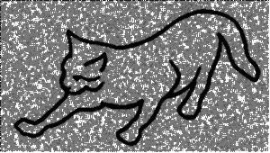

### Задание №2

- #### Разностное изображение

    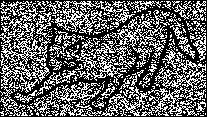

<a name="ex4"> <h2>Пример №4</h2> </a>
=======
    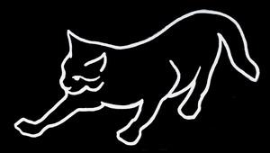

- #### Изображение с шумом и перцем

    

### Задание

|**Xолм**|**Впадина**|**Разностное**|
|--------|-----------|--------------|
||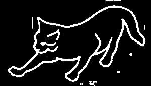|


<a name="ex4"> <h2>Пример №4</h2> </a>
---
- #### Исходное изображение

    


- #### Изображение с шумом и перцем

    

### Задание

|**Xолм**|**Впадина**|**Разностное**|
|--------|-----------|--------------|
|||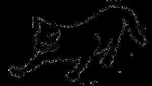

<a name="ex5"> <h2>Пример №5</h2> </a>
>>>>>>> dev

---

- #### Исходное изображение

    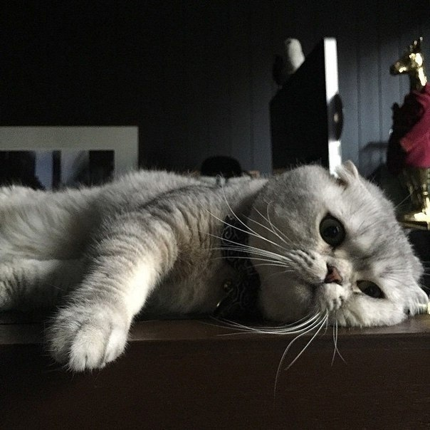

- #### Изображение с шумом и перцем

    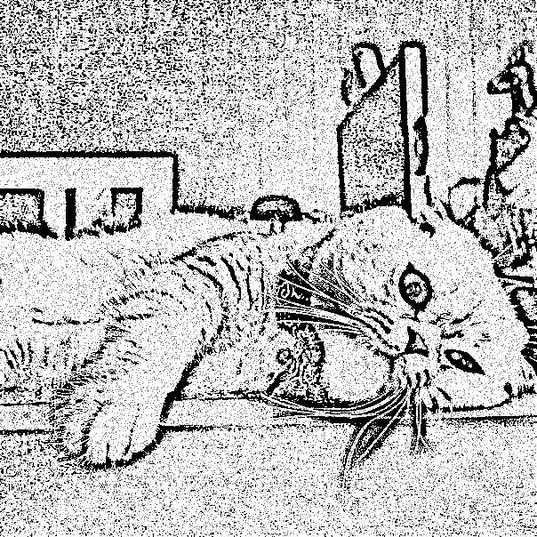

<<<<<<< HEAD
### Задание №1

- #### Ядро в виде холма

    

- #### Ядро в виде впадины

    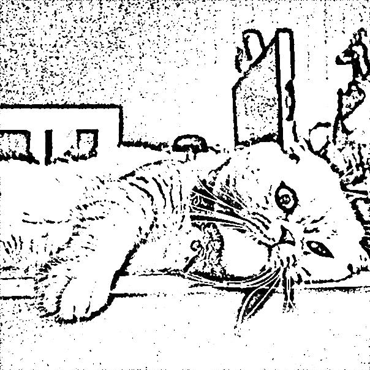

### Задание №2

- #### Разностное изображение

    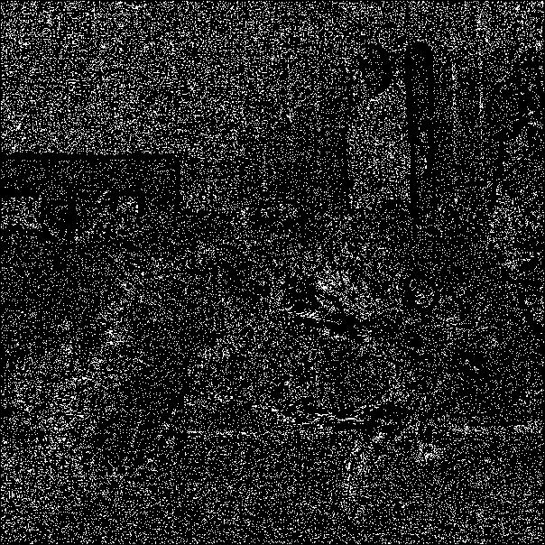

<a name="ex5"> <h2>Пример №5</h2> </a>
=======
### Задание

|**Xолм**|**Впадина**|**Разностное**|
|--------|-----------|--------------|
|||

<a name="ex6"> <h2>Пример №6</h2> </a>
>>>>>>> dev

---

- #### Исходное изображение

    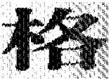

- #### Изображение с шумом и перцем

    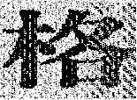

### Задание №1

- #### Ядро в виде холма

    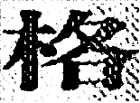

- #### Ядро в виде впадины

    

### Задание №2

- #### Разностное изображение

    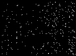

<<<<<<< HEAD
<a name="ex6"> <h2>Пример №6</h2> </a>
=======
<a name="ex7"> <h2>Пример №7</h2> </a>
>>>>>>> dev

---

- #### Исходное изображение

    

- #### Изображение с шумом и перцем

    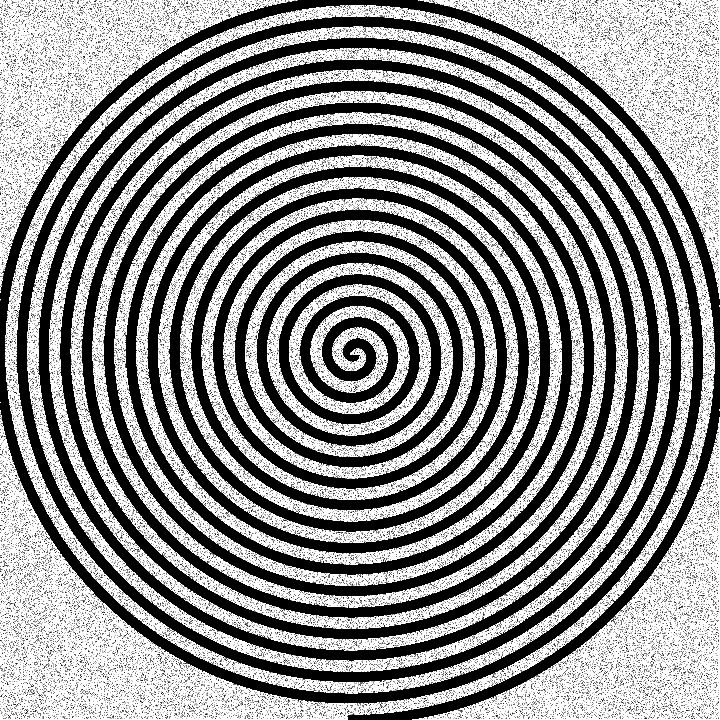

### Задание №1

- #### Ядро в виде холма

    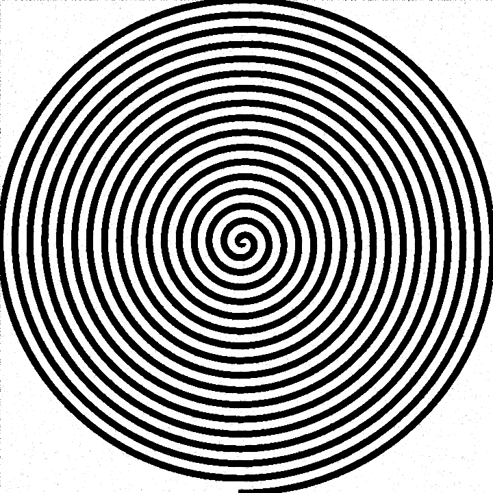

- #### Ядро в виде впадины

    

### Задание №2

- #### Разностное изображение

    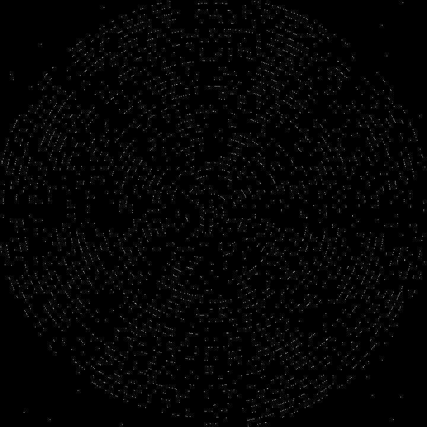

<<<<<<< HEAD
<a name="ex7"> <h2>Пример №7</h2> </a>
=======
<a name="ex8"> <h2>Пример №8</h2> </a>
>>>>>>> dev

---

- #### Исходное изображение

    

- #### Изображение с шумом и перцем

    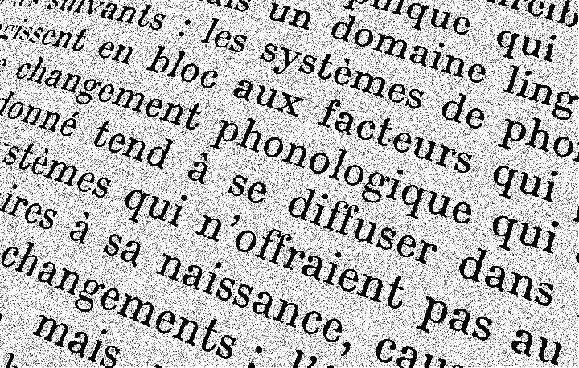

### Задание №1

- #### Ядро в виде холма

    

- #### Ядро в виде впадины

    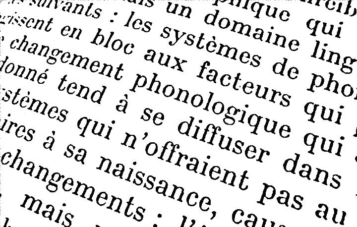

### Задание №2

- #### Разностное изображение

    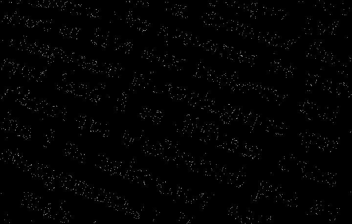

<<<<<<< HEAD
<a name="ex8"> <h2>Пример №8</h2> </a>
=======
<a name="ex9"> <h2>Пример №9</h2> </a>
>>>>>>> dev

---

- #### Исходное изображение

    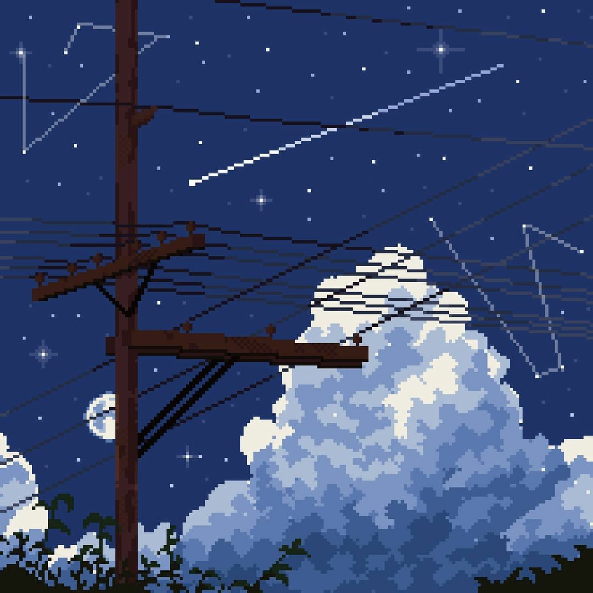

- #### Изображение с шумом и перцем

    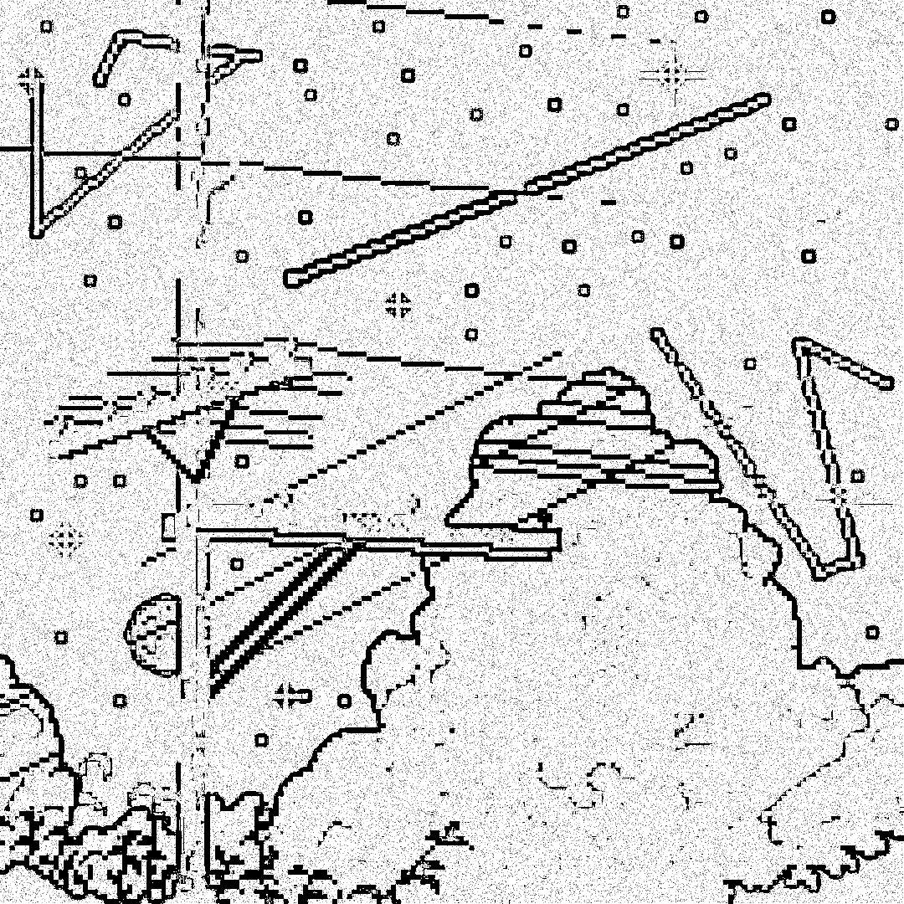

### Задание №1

- #### Ядро в виде холма

    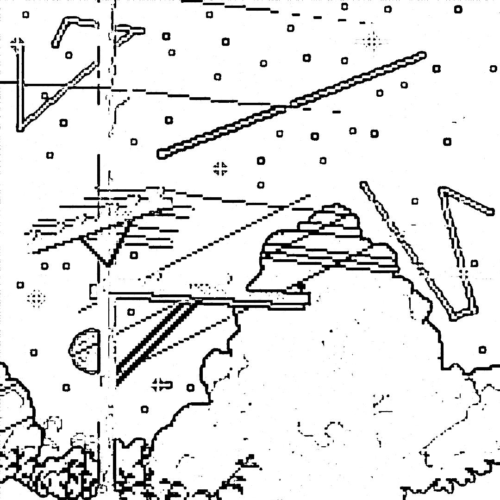

- #### Ядро в виде впадины

    

### Задание №2

- #### Разностное изображение

    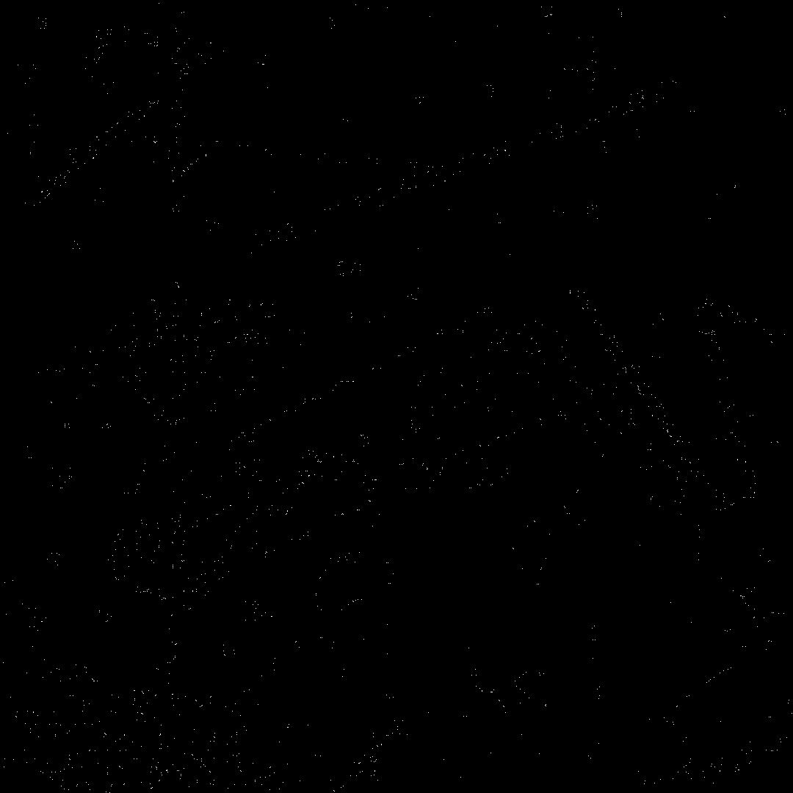
