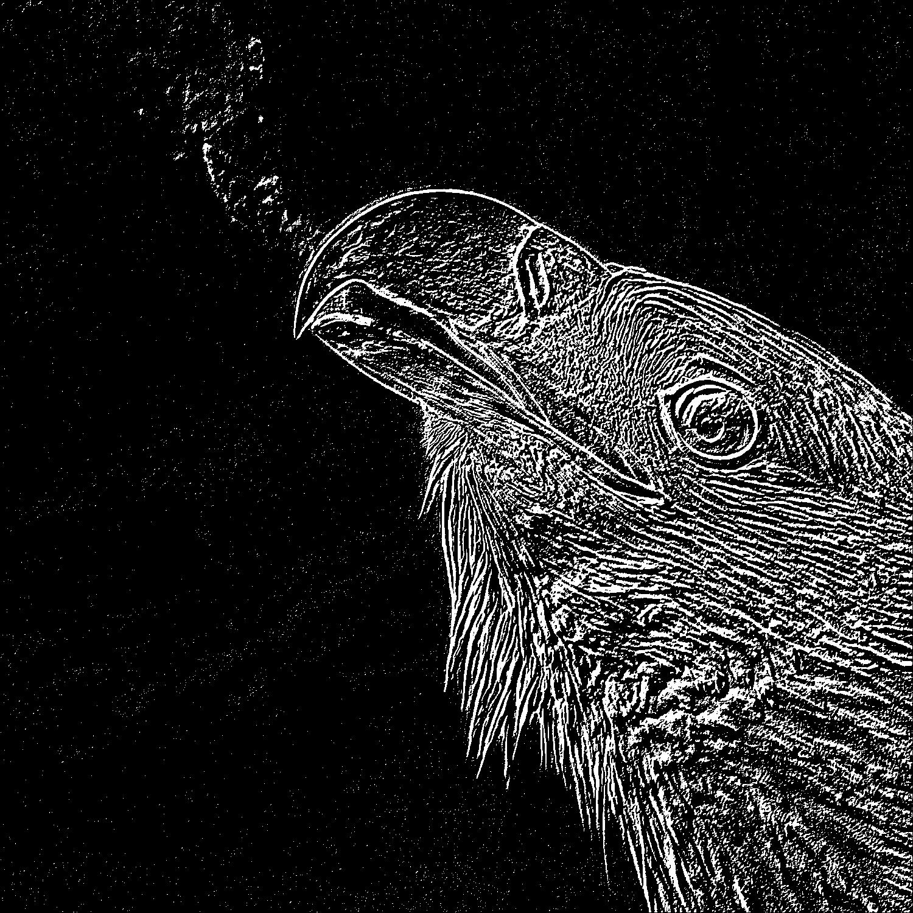
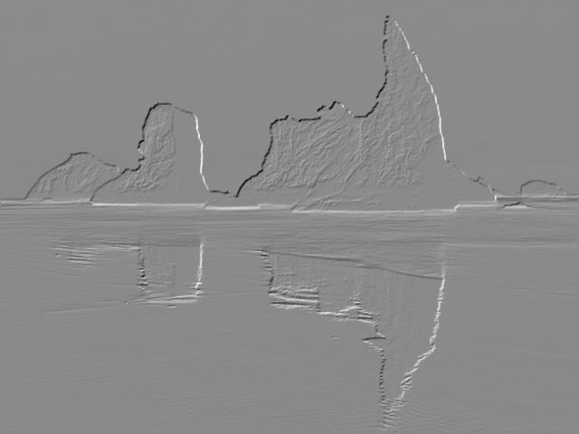
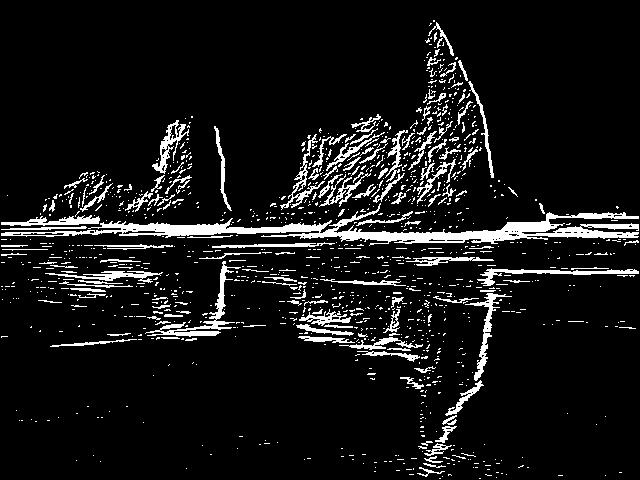

# Лабораторная работа №3

### Тема: Выделение контуров на изображении

|**Студент:**|*Долидзе Александра*|
|------------|--------------|
|**Группа:** |*Б18-514*     |
|**Вариант:**|*3*           |

#### Задание:

Оператор Собеля 3x3
```
    -1 -2 -1
Gx = 0 0 0    * A
     1 2 1
```
```
     -1 0 1
Gy = -2 0 2   * A
     -1 0 1
```
---

### Пример №1

|**Исходное изображение**|**Полутоновое изображение**|
|------------------------|---------------------------|
|||

|**Gx**|**Gy**|**G**|
|------|------|-----|
||||

|**T=124**|**T=126**|**T=128**|**T=130**|
|---------|---------|---------|------|
|||||
---
### Пример №2 (Баночки)

|**Исходное изображение**|**Полутоновое изображение**|
|------------------------|---------------------------|
|||

|**Gx**|**Gy**|**G**|
|------|------|-----|
||||

|**T=120**|**T=130**|**T=140**|**T=150**|
|---------|---------|---------|---------|
|||||
---
### Пример №3 (Текст)

|**Исходное изображение**|**Полутоновое изображение**|
|------------------------|---------------------------|
|||

|**Gx**|**Gy**|**G**|
|------|------|-----|
||||

|**T=138**|**T=140**|**T=142**|**T=144**|
|---------|---------|---------|---------|
|||||
---
### Пример №4 (Горы)

|**Исходное изображение**|**Полутоновое изображение**|
|------------------------|---------------------------|
|||

|**Gx**|**Gy**|**G**|
|------|------|-----|
||||

|**T=136**|**T=138**|**T=140**|**T=142**|
|---------|---------|---------|---------|
|||||
---
### Пример №6 (Книга)

|**Исходное изображение**|**Полутоновое изображение**|
|------------------------|---------------------------|
|||

|**Gx**|**Gy**|**G**|
|------|------|-----|
||||

|**T=132**|**T=134**|**T=136**|
|---------|---------|---------|
||||
