# Лабораторная работа №4

## Тема: Выделение признаков символов

|**Студент:**|*Камолов Амир*|
|------------|--------------|
|**Группа:** |*Б18-514*     |
|**Вариант:**|*Армянский алфавит*|

### Буква Ա
|Символ|Профиль по х|Профиль по y|
|---------------------|--------------------------|--------------------------|
|| 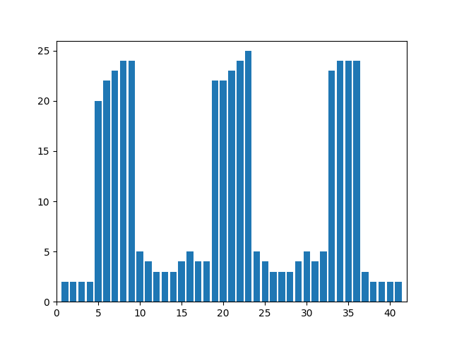| 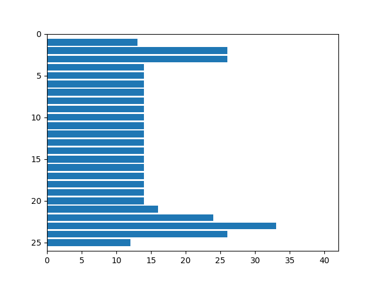|

|Признак|Значение|
|-------|--------|
|Вес чёрного|393|
|Нормированный вес чёрного|362.7692307692308|
|Центр масс|(7970.0, 7347.0)|
|Нормированный центр масс|(20.32908163265306, 18.739795918367346)|
|Моменты инерции|(21105749498.0, 24836884052.0)|
|Нормированные моменты инерции|(7492278.842030529, 8816785.250976216)|

### Буква ա
|Символ|Профиль по х|Профиль по y|
|---------------------|--------------------------|--------------------------|
|| | |

|Признак|Значение|
|-------|--------|
|Вес чёрного|414|
|Нормированный вес чёрного|252.4390243902439|
|Центр масс|(8475.0, 5546.0)|
|Нормированный центр масс|(20.5181598062954, 13.426150121065374)|
|Моменты инерции|(12672442732.0, 29592380997.0)|
|Нормированные моменты инерции|(5495421.826539462, 12832775.800954033)|

### Буква Բ
|Символ|Профиль по х|Профиль по y|
|---------------------|--------------------------|--------------------------|
|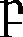| 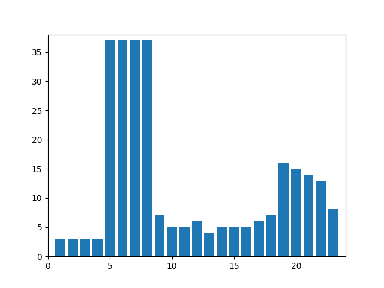| 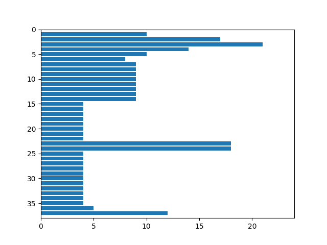|

|Признак|Значение|
|-------|--------|
|Вес чёрного|301|
|Нормированный вес чёрного|328.3636363636364|
|Центр масс|(4613.0, 5330.0)|
|Нормированный центр масс|(15.373333333333333, 17.763333333333332)|
|Моменты инерции|(8494389924.0, 6362747890.0)|
|Нормированные моменты инерции|(3561589.066666667, 2667818.821802935)|

### Буква բ
|Символ|Профиль по х|Профиль по y|
|---------------------|--------------------------|--------------------------|
|| | |

|Признак|Значение|
|-------|--------|
|Вес чёрного|281|
|Нормированный вес чёрного|452.04347826086956|
|Центр масс|(3105.0, 4399.0)|
|Нормированный центр масс|(11.085714285714285, 15.707142857142857)|
|Моменты инерции|(5399088382.0, 2689891576.0)|
|Нормированные моменты инерции|(2844619.8008429925, 1417224.2233930454)|

### Буква Գ
|Символ|Профиль по х|Профиль по y|
|---------------------|--------------------------|--------------------------|
|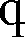| 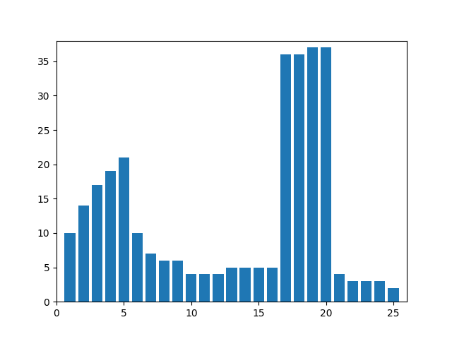| 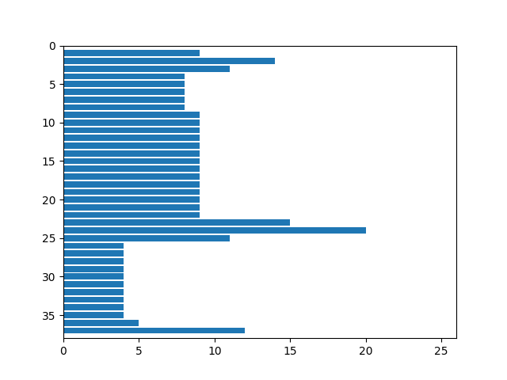|

|Признак|Значение|
|-------|--------|
|Вес чёрного|342|
|Нормированный вес чёрного|342.0|
|Центр масс|(6099.0, 6046.0)|
|Нормированный центр масс|(17.882697947214076, 17.727272727272727)|
|Моменты инерции|(12428541368.0, 12647394355.0)|
|Нормированные моменты инерции|(4794961.947530864, 4879395.97029321)|

### Буква գ
|Символ|Профиль по х|Профиль по y|
|---------------------|--------------------------|--------------------------|
|| | |

|Признак|Значение|
|-------|--------|
|Вес чёрного|303|
|Нормированный вес чёрного|448.44|
|Центр масс|(3947.0, 5207.0)|
|Нормированный центр масс|(13.066225165562914, 17.23841059602649)|
|Моменты инерции|(8161088330.0, 4689287826.0)|
|Нормированные моменты инерции|(4092822.632898696, 2351699.0100300903)|

### Буква Դ
|Символ|Профиль по х|Профиль по y|
|---------------------|--------------------------|--------------------------|
|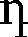| 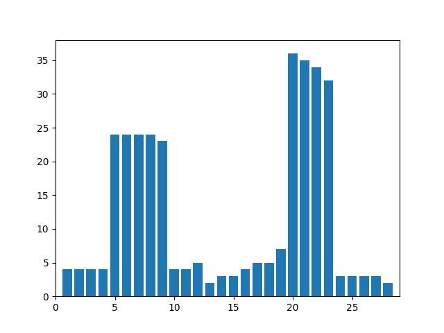| 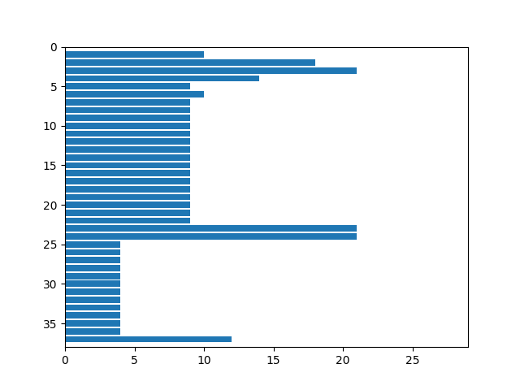|

|Признак|Значение|
|-------|--------|
|Вес чёрного|287|
|Нормированный вес чёрного|295.2|
|Центр масс|(5599.0, 4889.0)|
|Нормированный центр масс|(19.573426573426573, 17.09090909090909)|
|Моменты инерции|(6812278978.0, 8934545968.0)|
|Нормированные моменты инерции|(2702213.00198334, 3544048.3808012693)|

### Буква դ
|Символ|Профиль по х|Профиль по y|
|---------------------|--------------------------|--------------------------|
|| | |

|Признак|Значение|
|-------|--------|
|Вес чёрного|328|
|Нормированный вес чёрного|433.4285714285714|
|Центр масс|(4801.0, 5253.0)|
|Нормированный центр масс|(14.678899082568808, 16.061162079510705)|
|Моменты инерции|(8995766207.0, 7514258511.0)|
|Нормированные моменты инерции|(4178247.1932187644, 3490134.0041802134)|

### Буква Ե
|Символ|Профиль по х|Профиль по y|
|---------------------|--------------------------|--------------------------|
|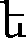| 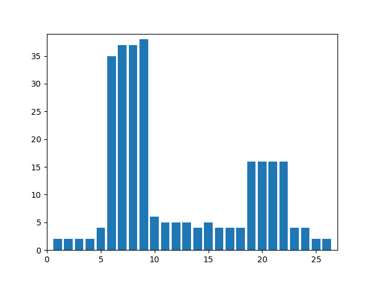| 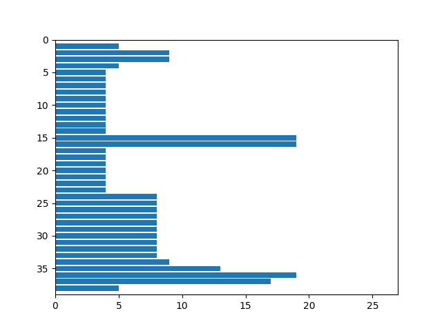|

|Признак|Значение|
|-------|--------|
|Вес чёрного|302|
|Нормированный вес чёрного|339.75|
|Центр масс|(4614.0, 5677.0)|
|Нормированный центр масс|(15.325581395348838, 18.857142857142858)|
|Моменты инерции|(9668641217.0, 6386795330.0)|
|Нормированные моменты инерции|(4167517.765948276, 2752929.021551724)|

### Буква ե
|Символ|Профиль по х|Профиль по y|
|---------------------|--------------------------|--------------------------|
|| | |

|Признак|Значение|
|-------|--------|
|Вес чёрного|277|
|Нормированный вес чёрного|404.8461538461538|
|Центр масс|(3324.0, 6143.0)|
|Нормированный центр масс|(12.039855072463768, 22.253623188405797)|
|Моменты инерции|(10377695154.0, 3038519232.0)|
|Нормированные моменты инерции|(4895139.223584905, 1433263.7886792454)|

### Буква Զ
|Символ|Профиль по х|Профиль по y|
|---------------------|--------------------------|--------------------------|
|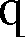| 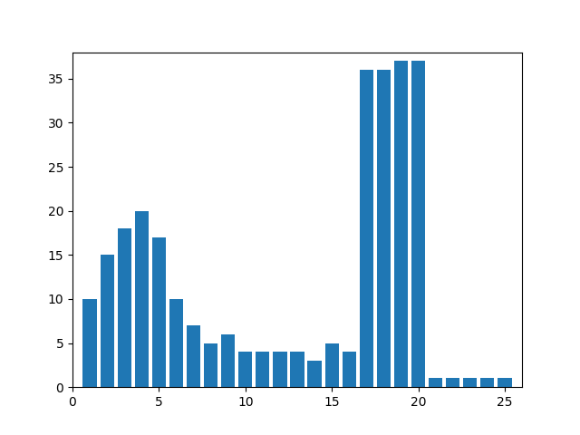| 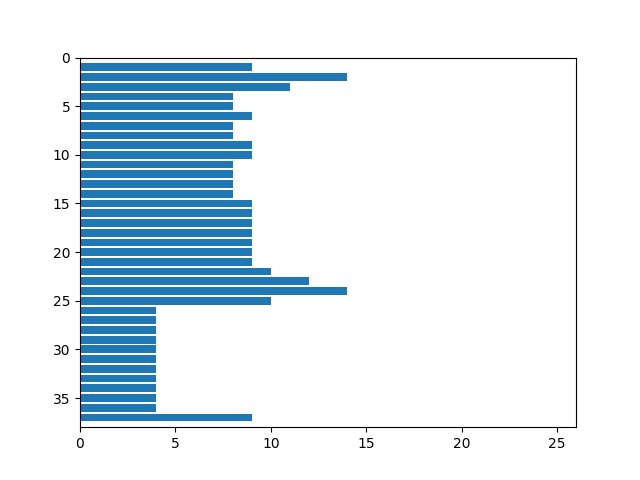|

|Признак|Значение|
|-------|--------|
|Вес чёрного|372|
|Нормированный вес чёрного|458.8|
|Центр масс|(5831.0, 7305.0)|
|Нормированный центр масс|(15.714285714285714, 19.68733153638814)|
|Моменты инерции|(19744506777.0, 12580327675.0)|
|Нормированные моменты инерции|(8701854.022476861, 5544437.053768179)|

### Буква զ
|Символ|Профиль по х|Профиль по y|
|---------------------|--------------------------|--------------------------|
|| | |

|Признак|Значение|
|-------|--------|
|Вес чёрного|287|
|Нормированный вес чёрного|424.76|
|Центр масс|(3645.0, 4800.0)|
|Нормированный центр масс|(12.741258741258742, 16.77972027972028)|
|Моменты инерции|(6566509600.0, 3786577364.0)|
|Нормированные моменты инерции|(3293134.2026078235, 1898985.6389167502)|

### Буква Է
|Символ|Профиль по х|Профиль по y|
|---------------------|--------------------------|--------------------------|
|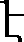| 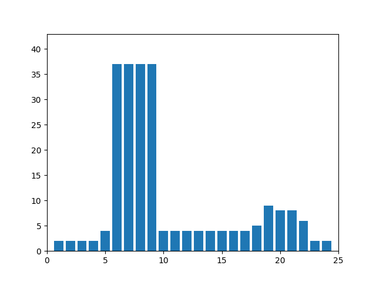| 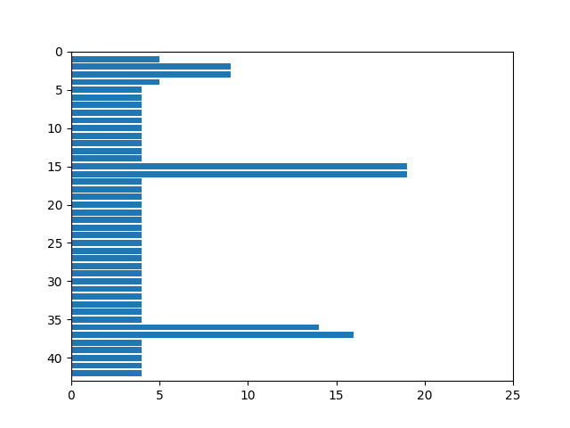|

|Признак|Значение|
|-------|--------|
|Вес чёрного|270|
|Нормированный вес чёрного|400.0|
|Центр масс|(3385.0, 5214.0)|
|Нормированный центр масс|(12.579925650557621, 19.37918215613383)|
|Моменты инерции|(7285932938.0, 3070860339.0)|
|Нормированные моменты инерции|(3128352.485186775, 1318531.7041648775)|

### Буква է
|Символ|Профиль по х|Профиль по y|
|---------------------|--------------------------|--------------------------|
|| | |

|Признак|Значение|
|-------|--------|
|Вес чёрного|232|
|Нормированный вес чёрного|406.0|
|Центр масс|(2397.0, 4911.0)|
|Нормированный центр масс|(10.372294372294371, 21.255411255411257)|
|Моменты инерции|(5547260855.0, 1321521451.0)|
|Нормированные моменты инерции|(2370624.297008547, 564752.7568376069)|

### Буква Ը
|Символ|Профиль по х|Профиль по y|
|---------------------|--------------------------|--------------------------|
|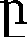| 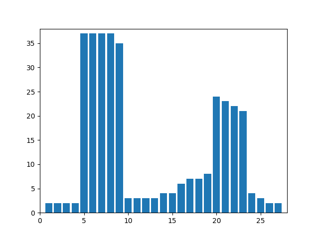| 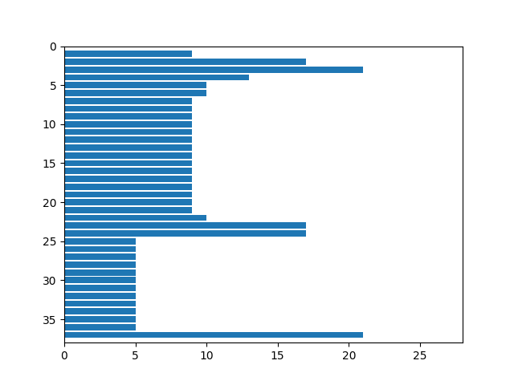|

|Признак|Значение|
|-------|--------|
|Вес чёрного|289|
|Нормированный вес чёрного|417.44444444444446|
|Центр масс|(3392.0, 5388.0)|
|Нормированный центр масс|(11.774305555555555, 18.70486111111111)|
|Моменты инерции|(8331911468.0, 3302192068.0)|
|Нормированные моменты инерции|(3703071.7635555556, 1467640.9191111112)|

### Буква ը
|Символ|Профиль по х|Профиль по y|
|---------------------|--------------------------|--------------------------|
|| | |

|Признак|Значение|
|-------|--------|
|Вес чёрного|340|
|Нормированный вес чёрного|465.925925925926|
|Центр масс|(4251.0, 5784.0)|
|Нормированный центр масс|(12.536873156342184, 17.058997050147493)|
|Моменты инерции|(11307812696.0, 6108068161.0)|
|Нормированные моменты инерции|(5389805.860819829, 2911376.625834128)|

### Буква Թ
|Символ|Профиль по х|Профиль по y|
|---------------------|--------------------------|--------------------------|
|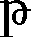| 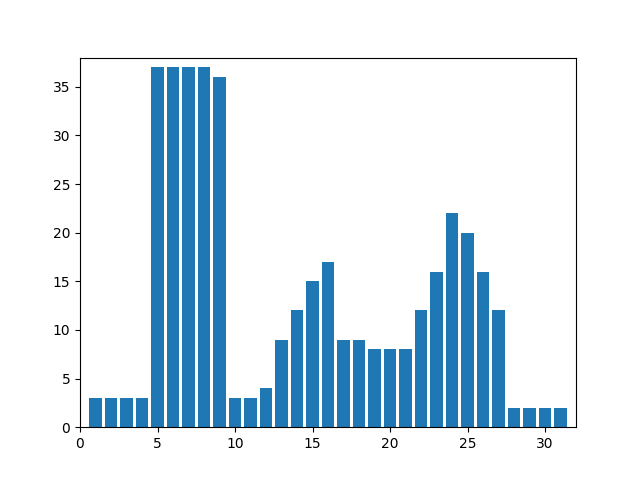| 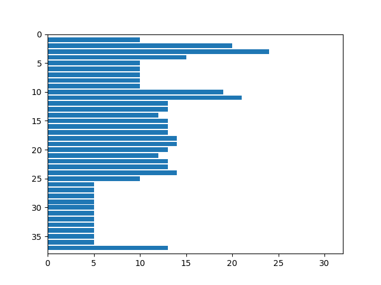|

|Признак|Значение|
|-------|--------|
|Вес чёрного|444|
|Нормированный вес чёрного|389.8536585365854|
|Центр масс|(8724.0, 8143.0)|
|Нормированный центр масс|(19.69074492099323, 18.37923250564334)|
|Моменты инерции|(29308525781.0, 33640034948.0)|
|Нормированные моменты инерции|(9844986.825999329, 11299978.148471616)|

### Буква թ
|Символ|Профиль по х|Профиль по y|
|---------------------|--------------------------|--------------------------|
|| | |

|Признак|Значение|
|-------|--------|
|Вес чёрного|407|
|Нормированный вес чёрного|485.7741935483871|
|Центр масс|(5640.0, 6457.0)|
|Нормированный центр масс|(13.889162561576354, 15.901477832512315)|
|Моменты инерции|(16885746580.0, 12882991396.0)|
|Нормированные моменты инерции|(7247101.536480687, 5529180.85665236)|

### Буква Ժ
|Символ|Профиль по х|Профиль по y|
|---------------------|--------------------------|--------------------------|
|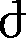| 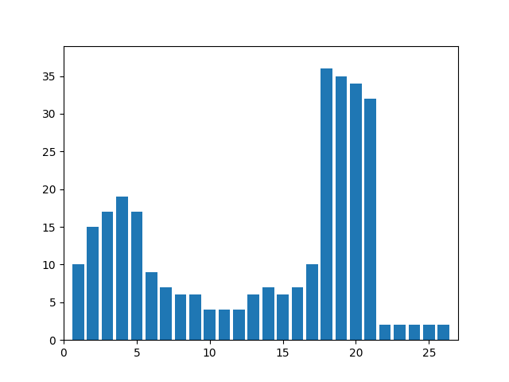| 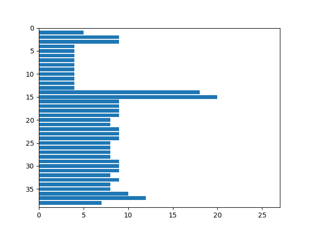|

|Признак|Значение|
|-------|--------|
|Вес чёрного|355|
|Нормированный вес чёрного|365.1428571428571|
|Центр масс|(6115.0, 6764.0)|
|Нормированный центр масс|(17.271186440677965, 19.1045197740113)|
|Моменты инерции|(16150514718.0, 13199947580.0)|
|Нормированные моменты инерции|(6406392.192780643, 5235996.660055534)|

### Буква ժ
|Символ|Профиль по х|Профиль по y|
|---------------------|--------------------------|--------------------------|
|| | |

|Признак|Значение|
|-------|--------|
|Вес чёрного|301|
|Нормированный вес чёрного|439.9230769230769|
|Центр масс|(4042.0, 6354.0)|
|Нормированный центр масс|(13.47, 21.176666666666666)|
|Моменты инерции|(12071788320.0, 4885061594.0)|
|Нормированные моменты инерции|(5694239.773584906, 2304274.3367924527)|

### Буква Ի
|Символ|Профиль по х|Профиль по y|
|---------------------|--------------------------|--------------------------|
|| 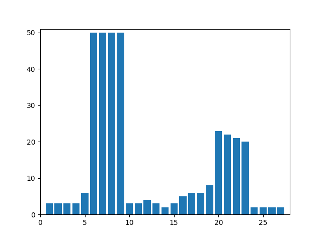| 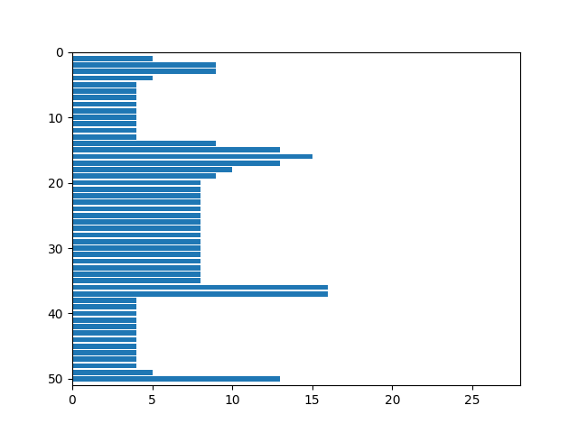|

|Признак|Значение|
|-------|--------|
|Вес чёрного|284|
|Нормированный вес чёрного|342.7586206896551|
|Центр масс|(3703.0, 4811.0)|
|Нормированный центр масс|(13.081272084805654, 16.996466431095406)|
|Моменты инерции|(6527203665.0, 3866911055.0)|
|Нормированные моменты инерции|(3159343.4970958373, 1871689.765246854)|

### Буква ի
|Символ|Профиль по х|Профиль по y|
|---------------------|--------------------------|--------------------------|
|| | |

|Признак|Значение|
|-------|--------|
|Вес чёрного|355|
|Нормированный вес чёрного|657.4074074074074|
|Центр масс|(4273.0, 9002.0)|
|Нормированный центр масс|(12.067796610169491, 25.426553672316384)|
|Моменты инерции|(28606000006.0, 6445327994.0)|
|Нормированные моменты инерции|(8859089.50325178, 1996075.563332301)|

### Буква Լ
|Символ|Профиль по х|Профиль по y|
|---------------------|--------------------------|--------------------------|
|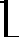| 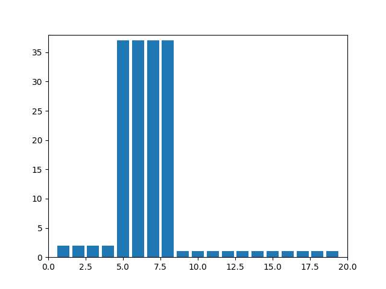| 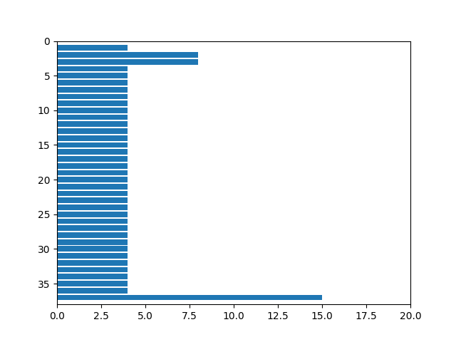|

|Признак|Значение|
|-------|--------|
|Вес чёрного|219|
|Нормированный вес чёрного|324.44444444444446|
|Центр масс|(2381.0, 4538.0)|
|Нормированный центр масс|(10.917431192660551, 20.81192660550459)|
|Моменты инерции|(4468908480.0, 1230243080.0)|
|Нормированные моменты инерции|(1918809.9957063117, 528228.0291970803)|

### Буква լ
|Символ|Профиль по х|Профиль по y|
|---------------------|--------------------------|--------------------------|
|| | |

|Признак|Значение|
|-------|--------|
|Вес чёрного|167|
|Нормированный вес чёрного|325.2105263157894|
|Центр масс|(1136.0, 3239.0)|
|Нормированный центр масс|(6.837349397590361, 19.50602409638554)|
|Моменты инерции|(1731120376.0, 212940604.0)|
|Нормированные моменты инерции|(1000647.6161849711, 123087.05433526011)|

### Буква Խ
|Символ|Профиль по х|Профиль по y|
|---------------------|--------------------------|--------------------------|
|| 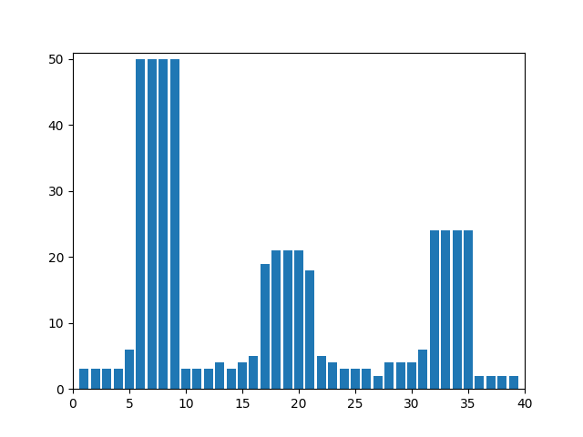| 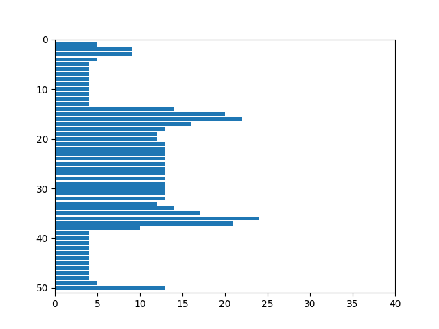|

|Признак|Значение|
|-------|--------|
|Вес чёрного|393|
|Нормированный вес чёрного|382.0833333333333|
|Центр масс|(6821.0, 7366.0)|
|Нормированный центр масс|(17.397959183673468, 18.788265306122447)|
|Моменты инерции|(21215035784.0, 18191846746.0)|
|Нормированные моменты инерции|(8415325.578738596, 7216123.262990877)|

### Буква խ
|Символ|Профиль по х|Профиль по y|
|---------------------|--------------------------|--------------------------|
|| | |

|Признак|Значение|
|-------|--------|
|Вес чёрного|485|
|Нормированный вес чёрного|621.7948717948718|
|Центр масс|(8322.0, 12473.0)|
|Нормированный центр масс|(17.19214876033058, 25.768595041322314)|
|Моменты инерции|(75143467614.0, 33450694472.0)|
|Нормированные моменты инерции|(18687756.183536433, 8318998.873911962)|

### Буква Ծ
|Символ|Профиль по х|Профиль по y|
|---------------------|--------------------------|--------------------------|
|| 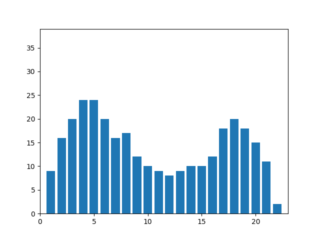| 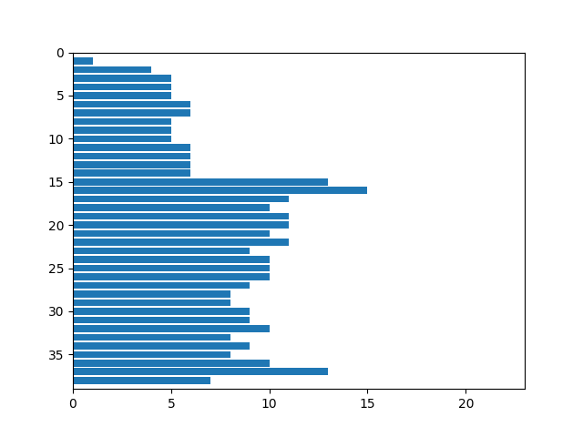|

|Признак|Значение|
|-------|--------|
|Вес чёрного|408|
|Нормированный вес чёрного|408.0|
|Центр масс|(7866.0, 7417.0)|
|Нормированный центр масс|(19.324324324324323, 18.22113022113022)|
|Моменты инерции|(22335013121.0, 25121030306.0)|
|Нормированные моменты инерции|(7733730.305055401, 8698417.69598338)|

### Буква ծ
|Символ|Профиль по х|Профиль по y|
|---------------------|--------------------------|--------------------------|
|| | |

|Признак|Значение|
|-------|--------|
|Вес чёрного|310|
|Нормированный вес чёрного|535.4545454545455|
|Центр масс|(3270.0, 6747.0)|
|Нормированный центр масс|(10.579288025889968, 21.831715210355988)|
|Моменты инерции|(14020955705.0, 3293460044.0)|
|Нормированные моменты инерции|(7272279.929979254, 1708226.163900415)|

### Буква Կ
|Символ|Профиль по х|Профиль по y|
|---------------------|--------------------------|--------------------------|
|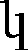| 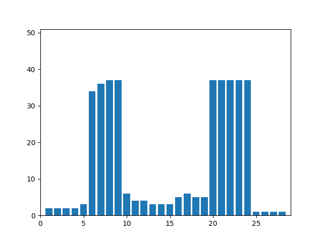| 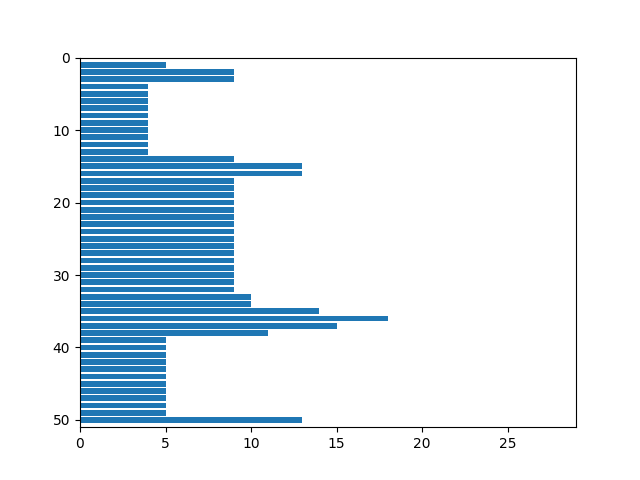|

|Признак|Значение|
|-------|--------|
|Вес чёрного|313|
|Нормированный вес чёрного|322.20588235294116|
|Центр масс|(5934.0, 5264.0)|
|Нормированный центр масс|(19.016025641025642, 16.868589743589745)|
|Моменты инерции|(8617834982.0, 10951183042.0)|
|Нормированные моменты инерции|(3619418.3040739186, 4599404.889542209)|

### Буква կ
|Символ|Профиль по х|Профиль по y|
|---------------------|--------------------------|--------------------------|
|| | |

|Признак|Значение|
|-------|--------|
|Вес чёрного|388|
|Нормированный вес чёрного|692.8571428571429|
|Центр масс|(5941.0, 10298.0)|
|Нормированный центр масс|(15.348837209302326, 26.607235142118864)|
|Моменты инерции|(40935178076.0, 13624166747.0)|
|Нормированные моменты инерции|(12465035.954933008, 4148650.0447624847)|

### Буква Հ
|Символ|Профиль по х|Профиль по y|
|---------------------|--------------------------|--------------------------|
|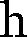| 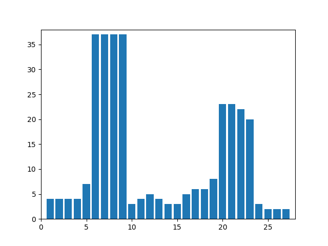| 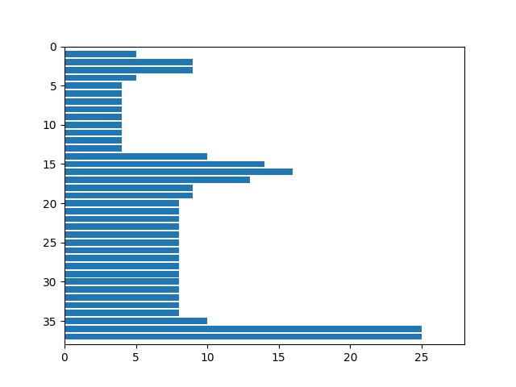|

|Признак|Значение|
|-------|--------|
|Вес чёрного|226|
|Нормированный вес чёрного|379.67999999999995|
|Центр масс|(3141.0, 5658.0)|
|Нормированный центр масс|(13.955555555555556, 25.142222222222223)|
|Моменты инерции|(7171082686.0, 2210008983.0)|
|Нормированные моменты инерции|(3001708.951862704, 925077.0125575555)|

### Буква հ
|Символ|Профиль по х|Профиль по y|
|---------------------|--------------------------|--------------------------|
|| | |

|Признак|Значение|
|-------|--------|
|Вес чёрного|315|
|Нормированный вес чёрного|431.66666666666663|
|Центр масс|(4015.0, 6969.0)|
|Нормированный центр масс|(12.78343949044586, 22.191082802547772)|
|Моменты инерции|(15201649874.0, 5045696878.0)|
|Нормированные моменты инерции|(7245781.636796949, 2405003.278360343)|

### Буква Ձ
|Символ|Профиль по х|Профиль по y|
|---------------------|--------------------------|--------------------------|
|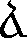| 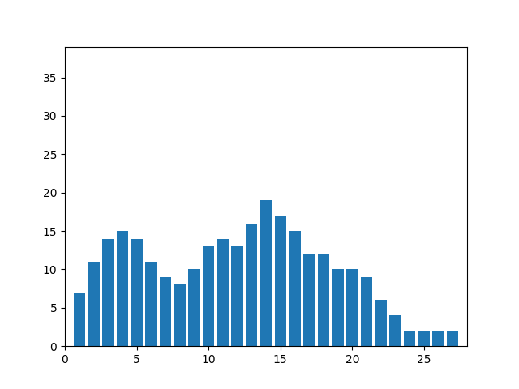| 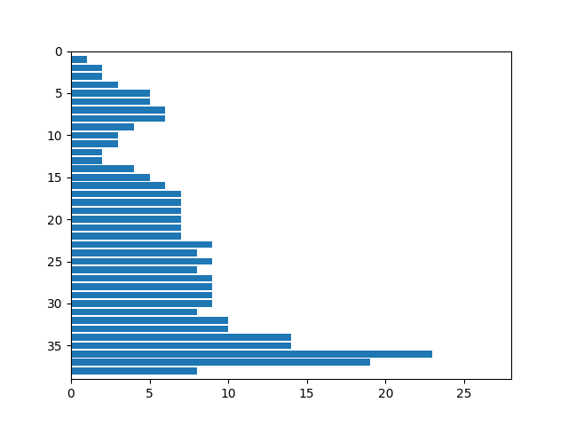|

|Признак|Значение|
|-------|--------|
|Вес чёрного|361|
|Нормированный вес чёрного|460.58620689655174|
|Центр масс|(5751.0, 7485.0)|
|Нормированный центр масс|(15.972222222222221, 20.788888888888888)|
|Моменты инерции|(20113260146.0, 11873685572.0)|
|Нормированные моменты инерции|(9101022.690497737, 5372708.40361991)|

### Буква ձ
|Символ|Профиль по х|Профиль по y|
|---------------------|--------------------------|--------------------------|
|| | |

|Признак|Значение|
|-------|--------|
|Вес чёрного|277|
|Нормированный вес чёрного|389.85185185185185|
|Центр масс|(3320.0, 6920.0)|
|Нормированный центр масс|(12.02536231884058, 25.068840579710145)|
|Моменты инерции|(13168961420.0, 3031211052.0)|
|Нормированные моменты инерции|(6060267.565577542, 1394942.9599631845)|

### Буква Կ
|Символ|Профиль по х|Профиль по y|
|---------------------|--------------------------|--------------------------|
|| | |

|Признак|Значение|
|-------|--------|
|Вес чёрного|313|
|Нормированный вес чёрного|322.20588235294116|
|Центр масс|(5934.0, 5264.0)|
|Нормированный центр масс|(19.016025641025642, 16.868589743589745)|
|Моменты инерции|(8617834982.0, 10951183042.0)|
|Нормированные моменты инерции|(3619418.3040739186, 4599404.889542209)|

### Буква կ
|Символ|Профиль по х|Профиль по y|
|---------------------|--------------------------|--------------------------|
|| | |

|Признак|Значение|
|-------|--------|
|Вес чёрного|388|
|Нормированный вес чёрного|692.8571428571429|
|Центр масс|(5941.0, 10298.0)|
|Нормированный центр масс|(15.348837209302326, 26.607235142118864)|
|Моменты инерции|(40935178076.0, 13624166747.0)|
|Нормированные моменты инерции|(12465035.954933008, 4148650.0447624847)|

### Буква Ճ
|Символ|Профиль по х|Профиль по y|
|---------------------|--------------------------|--------------------------|
|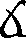| 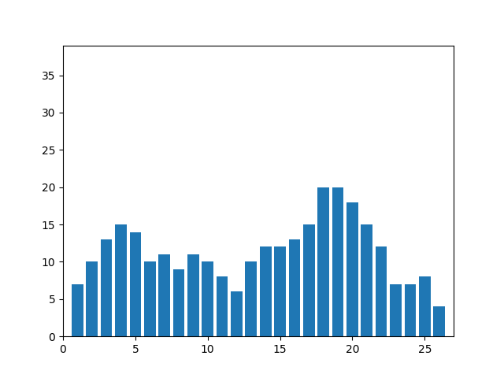| 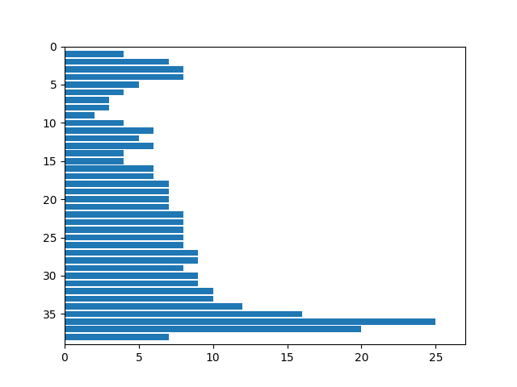|

|Признак|Значение|
|-------|--------|
|Вес чёрного|365|
|Нормированный вес чёрного|409.24242424242425|
|Центр масс|(5795.0, 7859.0)|
|Нормированный центр масс|(15.917582417582418, 21.587912087912088)|
|Моменты инерции|(22420504062.0, 12190393748.0)|
|Нормированные моменты инерции|(9121441.847843776, 4959476.707892596)|

### Буква ճ
|Символ|Профиль по х|Профиль по y|
|---------------------|--------------------------|--------------------------|
|| | |

|Признак|Значение|
|-------|--------|
|Вес чёрного|297|
|Нормированный вес чёрного|434.0769230769231|
|Центр масс|(4017.0, 7050.0)|
|Нормированный центр масс|(13.567567567567568, 23.81418918918919)|
|Моменты инерции|(14662441702.0, 4760274374.0)|
|Нормированные моменты инерции|(6916246.085849057, 2245412.440566038)|

### Буква Մ
|Символ|Профиль по х|Профиль по y|
|---------------------|--------------------------|--------------------------|
|| 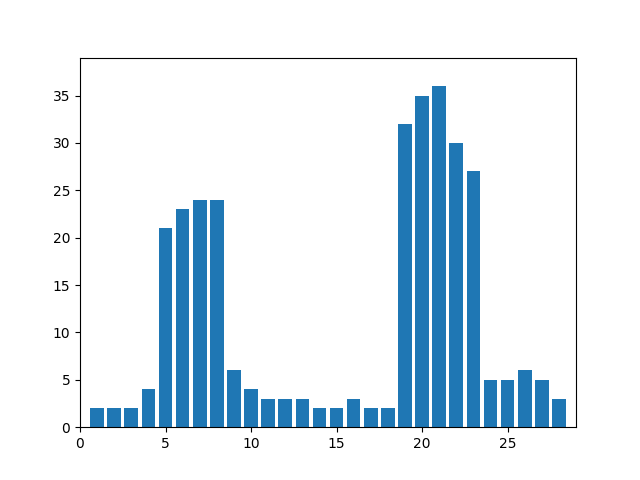| 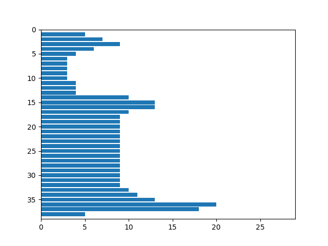|

|Признак|Значение|
|-------|--------|
|Вес чёрного|380|
|Нормированный вес чёрного|333.6585365853658|
|Центр масс|(7575.0, 6187.0)|
|Нормированный центр масс|(19.984168865435358, 16.321899736147756)|
|Моменты инерции|(14469602535.0, 21690076805.0)|
|Нормированные моменты инерции|(4860464.40544172, 7285884.046019482)|

### Буква մ
|Символ|Профиль по х|Профиль по y|
|---------------------|--------------------------|--------------------------|
|| | |

|Признак|Значение|
|-------|--------|
|Вес чёрного|316|
|Нормированный вес чёрного|428.8571428571429|
|Центр масс|(4974.0, 7177.0)|
|Нормированный центр масс|(15.787301587301588, 22.78095238095238)|
|Моменты инерции|(16174127653.0, 7768667734.0)|
|Нормированные моменты инерции|(7259482.788599641, 3486834.7100538597)|

### Буква Յ
|Символ|Профиль по х|Профиль по y|
|---------------------|--------------------------|--------------------------|
|| | 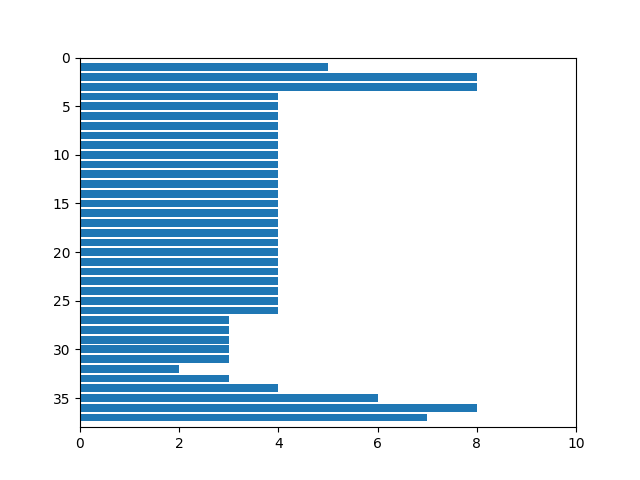|

|Признак|Значение|
|-------|--------|
|Вес чёрного|333|
|Нормированный вес чёрного|492.84000000000003|
|Центр масс|(4623.0, 6356.0)|
|Нормированный центр масс|(13.921686746987952, 19.14156626506024)|
|Моменты инерции|(13372142964.0, 7074259602.0)|
|Нормированные моменты инерции|(6706190.05215647, 3547773.120361083)|

### Буква յ
|Символ|Профиль по х|Профиль по y|
|---------------------|--------------------------|--------------------------|
|| | |

|Признак|Значение|
|-------|--------|
|Вес чёрного|158|
|Нормированный вес чёрного|649.5555555555557|
|Центр масс|(1096.0, 2916.0)|
|Нормированный центр масс|(6.974522292993631, 18.56687898089172)|
|Моменты инерции|(1326551478.0, 187397892.0)|
|Нормированные моменты инерции|(914863.088275862, 129239.92551724138)|

### Буква Ն
|Символ|Профиль по х|Профиль по y|
|---------------------|--------------------------|--------------------------|
|| 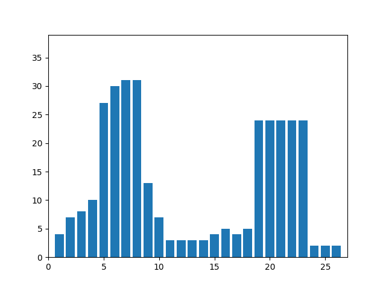| |

|Признак|Значение|
|-------|--------|
|Вес чёрного|246|
|Нормированный вес чёрного|253.0285714285714|
|Центр масс|(4194.0, 5262.0)|
|Нормированный центр масс|(17.114285714285714, 21.473469387755102)|
|Моменты инерции|(6756169990.0, 4291968060.0)|
|Нормированные моменты инерции|(2679956.362554542, 1702486.3387544625)|

### Буква ն
|Символ|Профиль по х|Профиль по y|
|---------------------|--------------------------|--------------------------|
|| | |

|Признак|Значение|
|-------|--------|
|Вес чёрного|324|
|Нормированный вес чёрного|473.53846153846155|
|Центр масс|(4167.0, 7303.0)|
|Нормированный центр масс|(12.897832817337461, 22.606811145510836)|
|Моменты инерции|(17173687907.0, 5591243293.0)|
|Нормированные моменты инерции|(8100796.18254717, 2637378.911792453)|

### Буква Շ
|Символ|Профиль по х|Профиль по y|
|---------------------|--------------------------|--------------------------|
|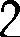| 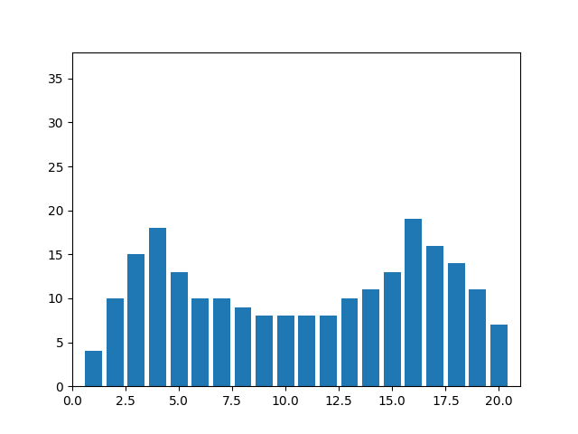| 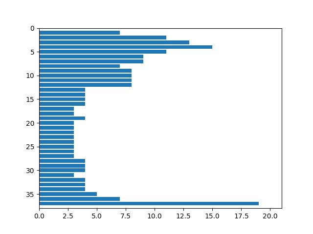|

|Признак|Значение|
|-------|--------|
|Вес чёрного|334|
|Нормированный вес чёрного|400.79999999999995|
|Центр масс|(4437.0, 5791.0)|
|Нормированный центр масс|(13.32132132132132, 17.38738738738739)|
|Моменты инерции|(11133990791.0, 6536154943.0)|
|Нормированные моменты инерции|(5070123.311020036, 2976391.139799636)|

### Буква շ
|Символ|Профиль по х|Профиль по y|
|---------------------|--------------------------|--------------------------|
|| | |

|Признак|Значение|
|-------|--------|
|Вес чёрного|222|
|Нормированный вес чёрного|410.7|
|Центр масс|(2400.0, 3636.0)|
|Нормированный центр масс|(10.855203619909503, 16.447963800904976)|
|Моменты инерции|(2908601898.0, 1267233352.0)|
|Нормированные моменты инерции|(1644206.8388920294, 716355.7671000565)|

### Буква Ո
|Символ|Профиль по х|Профиль по y|
|---------------------|--------------------------|--------------------------|
|| 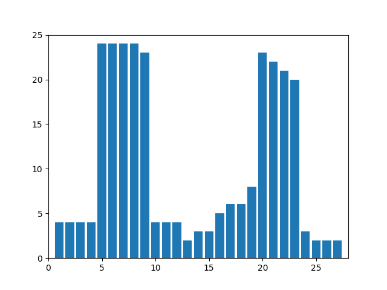| 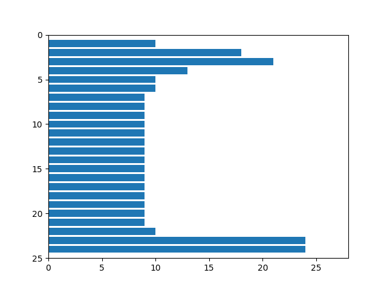|

|Признак|Значение|
|-------|--------|
|Вес чёрного|348|
|Нормированный вес чёрного|338.5945945945946|
|Центр масс|(6463.0, 6974.0)|
|Нормированный центр масс|(18.622478386167145, 20.095100864553313)|
|Моменты инерции|(16828476194.0, 14452706797.0)|
|Нормированные моменты инерции|(6314625.213508443, 5423154.520450281)|

### Буква ո
|Символ|Профиль по х|Профиль по y|
|---------------------|--------------------------|--------------------------|
|| | |

|Признак|Значение|
|-------|--------|
|Вес чёрного|275|
|Нормированный вес чёрного|244.44444444444446|
|Центр масс|(3630.0, 3509.0)|
|Нормированный центр масс|(13.244525547445255, 12.802919708029197)|
|Моменты инерции|(3361532542.0, 3597356200.0)|
|Нормированные моменты инерции|(2575887.0053639845, 2756594.789272031)|

### Буква Չ
|Символ|Профиль по х|Профиль по y|
|---------------------|--------------------------|--------------------------|
|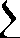| 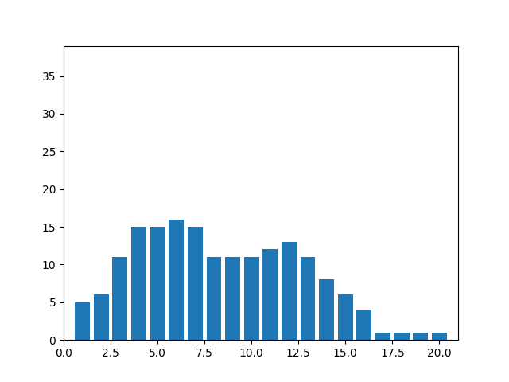| 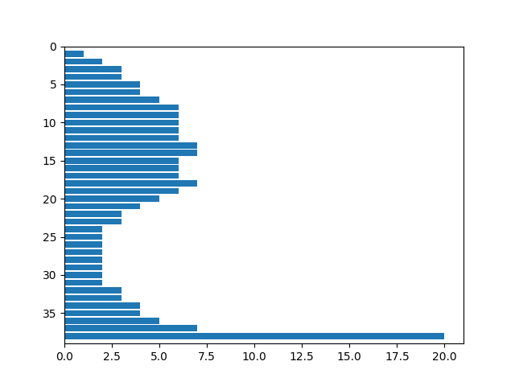|

|Признак|Значение|
|-------|--------|
|Вес чёрного|288|
|Нормированный вес чёрного|384.0|
|Центр масс|(4425.0, 5333.0)|
|Нормированный центр масс|(15.414634146341463, 18.578397212543553)|
|Моменты инерции|(8134230745.0, 5600145627.0)|
|Нормированные моменты инерции|(4016904.0716049382, 2765504.013333333)|

### Буква չ
|Символ|Профиль по х|Профиль по y|
|---------------------|--------------------------|--------------------------|
|| | |

|Признак|Значение|
|-------|--------|
|Вес чёрного|174|
|Нормированный вес чёрного|330.59999999999997|
|Центр масс|(1454.0, 3551.0)|
|Нормированный центр масс|(8.398843930635838, 20.520231213872833)|
|Моменты инерции|(2168946407.0, 363643200.0)|
|Нормированные моменты инерции|(1176218.2250542298, 197203.47071583514)|

### Буква Պ
|Символ|Профиль по х|Профиль по y|
|---------------------|--------------------------|--------------------------|
|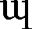| 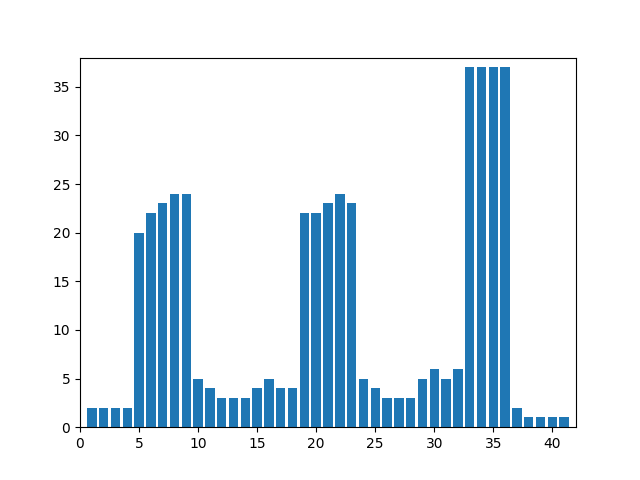| 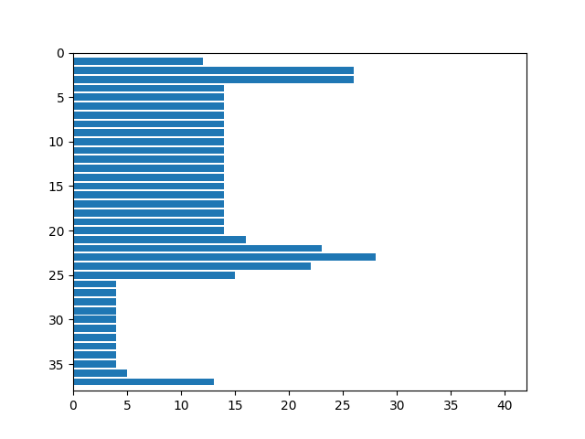|

|Признак|Значение|
|-------|--------|
|Вес чёрного|361|
|Нормированный вес чёрного|381.62857142857143|
|Центр масс|(7017.0, 6014.0)|
|Нормированный центр масс|(19.488888888888887, 16.70277777777778)|
|Моменты инерции|(12984523898.0, 17676711774.0)|
|Нормированные моменты инерции|(5005599.035466461, 6814460.9768697)|

### Буква պ
|Символ|Профиль по х|Профиль по y|
|---------------------|--------------------------|--------------------------|
|| | |

|Признак|Значение|
|-------|--------|
|Вес чёрного|464|
|Нормированный вес чёрного|418.73170731707313|
|Центр масс|(10183.0, 7268.0)|
|Нормированный центр масс|(21.99136069114471, 15.695464362850972)|
|Моменты инерции|(24404763886.0, 47906673515.0)|
|Нормированные моменты инерции|(8001561.9298360655, 15707106.070491804)|

### Буква Ջ
|Символ|Профиль по х|Профиль по y|
|---------------------|--------------------------|--------------------------|
|| 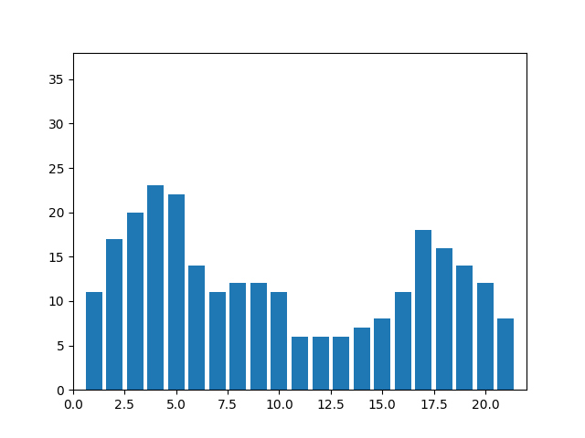| 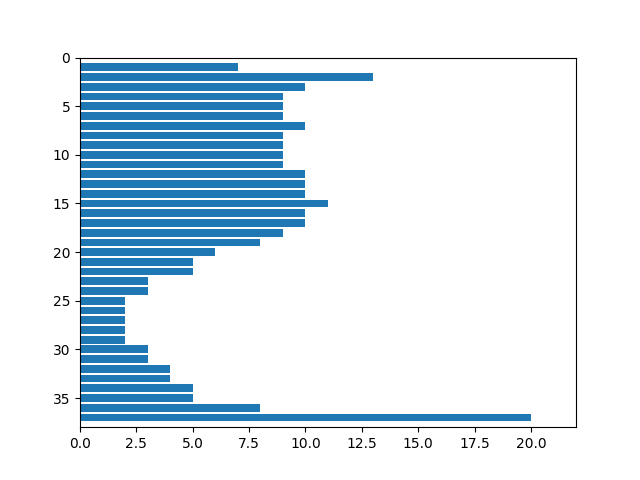|

|Признак|Значение|
|-------|--------|
|Вес чёрного|373|
|Нормированный вес чёрного|460.03333333333336|
|Центр масс|(5861.0, 7483.0)|
|Нормированный центр масс|(15.75268817204301, 20.112903225806452)|
|Моменты инерции|(20774444564.0, 12744460312.0)|
|Нормированные моменты инерции|(9155771.07271926, 5616774.046716616)|

### Буква ջ
|Символ|Профиль по х|Профиль по y|
|---------------------|--------------------------|--------------------------|
|| | |

|Признак|Значение|
|-------|--------|
|Вес чёрного|265|
|Нормированный вес чёрного|466.90476190476187|
|Центр масс|(2660.0, 4371.0)|
|Нормированный центр масс|(10.071969696969697, 16.553030303030305)|
|Моменты инерции|(5024888366.0, 1860920220.0)|
|Нормированные моменты инерции|(2776181.417679558, 1028132.7182320443)|

### Буква Ռ
|Символ|Профиль по х|Профиль по y|
|---------------------|--------------------------|--------------------------|
|| 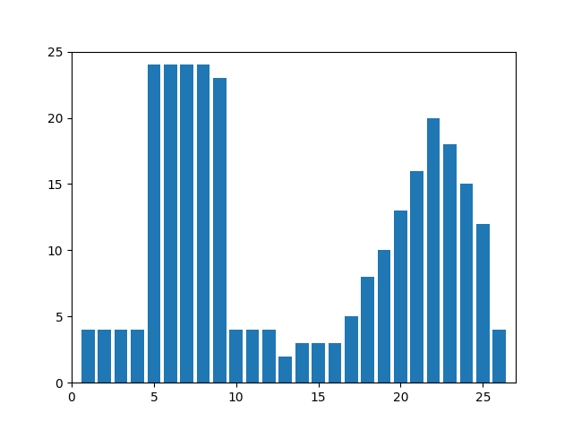| 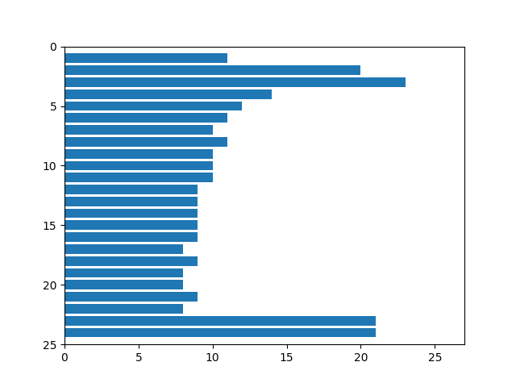|

|Признак|Значение|
|-------|--------|
|Вес чёрного|387|
|Нормированный вес чёрного|339.8048780487805|
|Центр масс|(7898.0, 7867.0)|
|Нормированный центр масс|(20.458549222797927, 20.378238341968913)|
|Моменты инерции|(23827737220.0, 24015898052.0)|
|Нормированные моменты инерции|(8003942.633523681, 8067147.481357071)|

### Буква ռ
|Символ|Профиль по х|Профиль по y|
|---------------------|--------------------------|--------------------------|
|| | |

|Признак|Значение|
|-------|--------|
|Вес чёрного|279|
|Нормированный вес чёрного|257.53846153846155|
|Центр масс|(3797.0, 3352.0)|
|Нормированный центр масс|(13.654676258992806, 12.053956834532373)|
|Моменты инерции|(3112402112.0, 3993634830.0)|
|Нормированные моменты инерции|(2485944.178913738, 3189804.177316294)|

### Буква Ս
|Символ|Профиль по х|Профиль по y|
|---------------------|--------------------------|--------------------------|
|| 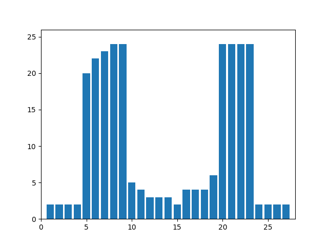| 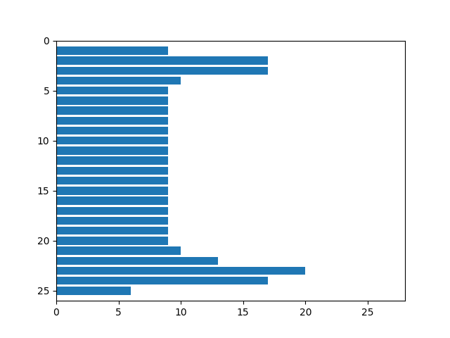|

|Признак|Значение|
|-------|--------|
|Вес чёрного|350|
|Нормированный вес чёрного|350.0|
|Центр масс|(6446.0, 6028.0)|
|Нормированный центр масс|(18.46704871060172, 17.269340974212035)|
|Моменты инерции|(12645351668.0, 14459876014.0)|
|Нормированные моменты инерции|(4878607.896604938, 5578655.869598766)|

### Буква ս
|Символ|Профиль по х|Профиль по y|
|---------------------|--------------------------|--------------------------|
|| | |

|Признак|Значение|
|-------|--------|
|Вес чёрного|263|
|Нормированный вес чёрного|243.5185185185185|
|Центр масс|(3648.0, 3448.0)|
|Нормированный центр масс|(13.919847328244275, 13.15648854961832)|
|Моменты инерции|(3103012518.0, 3473427214.0)|
|Нормированные моменты инерции|(2291737.457902511, 2565308.1344165434)|

### Буква Վ
|Символ|Профиль по х|Профиль по y|
|---------------------|--------------------------|--------------------------|
|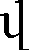| 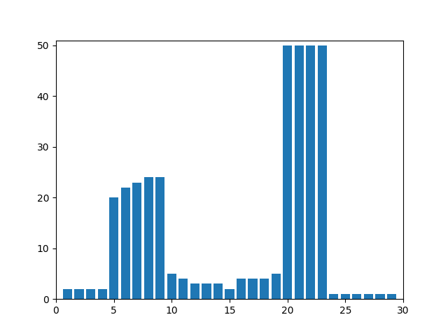| 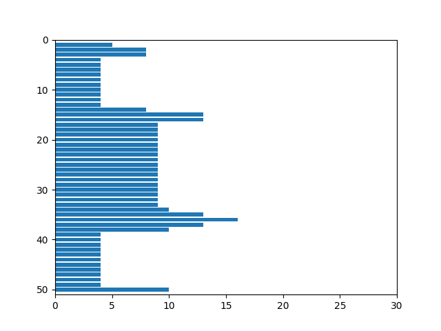|

|Признак|Значение|
|-------|--------|
|Вес чёрного|339|
|Нормированный вес чёрного|366.48648648648646|
|Центр масс|(7595.0, 6210.0)|
|Нормированный центр масс|(22.467455621301774, 18.369822485207102)|
|Моменты инерции|(12996253912.0, 19439714900.0)|
|Нормированные моменты инерции|(4377316.912091614, 6547563.118895251)|

### Буква վ
|Символ|Профиль по х|Профиль по y|
|---------------------|--------------------------|--------------------------|
|| | |

|Признак|Значение|
|-------|--------|
|Вес чёрного|364|
|Нормированный вес чёрного|627.5862068965517|
|Центр масс|(5820.0, 9393.0)|
|Нормированный центр масс|(16.03030303030303, 25.8732782369146)|
|Моменты инерции|(31939000067.0, 12261919932.0)|
|Нормированные моменты инерции|(9559712.680933852, 3670134.6698593237)|

### Буква Տ
|Символ|Профиль по х|Профиль по y|
|---------------------|--------------------------|--------------------------|
|| 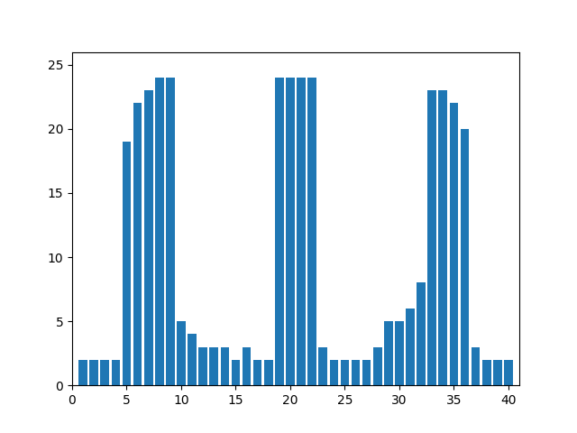| 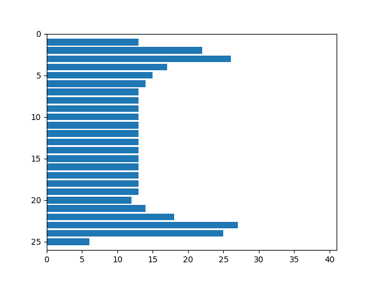|

|Признак|Значение|
|-------|--------|
|Вес чёрного|310|
|Нормированный вес чёрного|458.8|
|Центр масс|(4169.0, 5938.0)|
|Нормированный центр масс|(13.488673139158577, 19.21359223300971)|
|Моменты инерции|(10860184486.0, 5353285197.0)|
|Нормированные моменты инерции|(5446431.537612839, 2684696.688565697)|

### Буква տ
|Символ|Профиль по х|Профиль по y|
|---------------------|--------------------------|--------------------------|
|| | |

|Признак|Значение|
|-------|--------|
|Вес чёрного|378|
|Нормированный вес чёрного|236.24999999999997|
|Центр масс|(7613.0, 4860.0)|
|Нормированный центр масс|(20.190981432360743, 12.888594164456233)|
|Моменты инерции|(8881054132.0, 21792322053.0)|
|Нормированные моменты инерции|(3991485.0031460673, 9794302.046292135)|

### Буква Ր
|Символ|Профиль по х|Профиль по y|
|---------------------|--------------------------|--------------------------|
|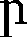| 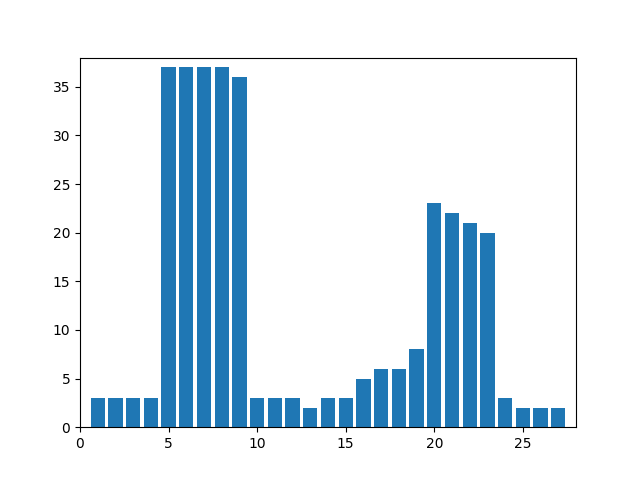| 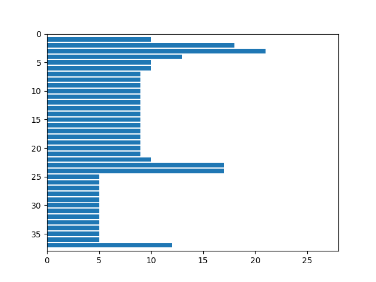|

|Признак|Значение|
|-------|--------|
|Вес чёрного|240|
|Нормированный вес чёрного|278.7096774193549|
|Центр масс|(3178.0, 3980.0)|
|Нормированный центр масс|(13.292887029288703, 16.648535564853557)|
|Моменты инерции|(3770114124.0, 2403784282.0)|
|Нормированные моменты инерции|(1670409.447939743, 1065035.1271599468)|

### Буква ր
|Символ|Профиль по х|Профиль по y|
|---------------------|--------------------------|--------------------------|
|| | |

|Признак|Значение|
|-------|--------|
|Вес чёрного|333|
|Нормированный вес чёрного|456.33333333333337|
|Центр масс|(4042.0, 5454.0)|
|Нормированный центр масс|(12.171686746987952, 16.424698795180724)|
|Моменты инерции|(9846091048.0, 5407865304.0)|
|Нормированные моменты инерции|(4693084.38894185, 2577628.838894185)|

### Буква Ց
|Символ|Профиль по х|Профиль по y|
|---------------------|--------------------------|--------------------------|
|| 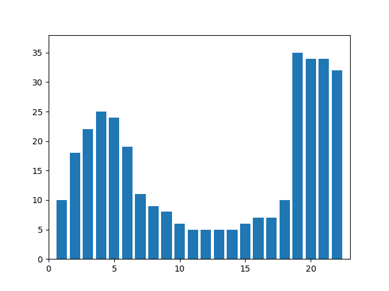| 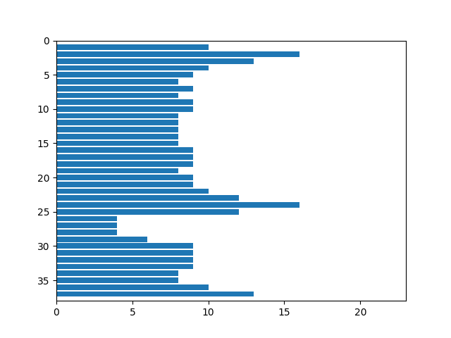|

|Признак|Значение|
|-------|--------|
|Вес чёрного|323|
|Нормированный вес чёрного|459.6538461538462|
|Центр масс|(4661.0, 6196.0)|
|Нормированный центр масс|(14.472049689440993, 19.23913043478261)|
|Моменты инерции|(12323481142.0, 6973785386.0)|
|Нормированные моменты инерции|(6026152.147677261, 3410164.0029339856)|

### Буква ց
|Символ|Профиль по х|Профиль по y|
|---------------------|--------------------------|--------------------------|
|| | |

|Признак|Значение|
|-------|--------|
|Вес чёрного|337|
|Нормированный вес чёрного|566.7727272727273|
|Центр масс|(4241.0, 6217.0)|
|Нормированный центр масс|(12.619047619047619, 18.5)|
|Моменты инерции|(12948270656.0, 6025409734.0)|
|Нормированные моменты инерции|(6987733.7593092285, 3251705.199136535)|

### Буква Ւ
|Символ|Профиль по х|Профиль по y|
|---------------------|--------------------------|--------------------------|
|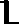| 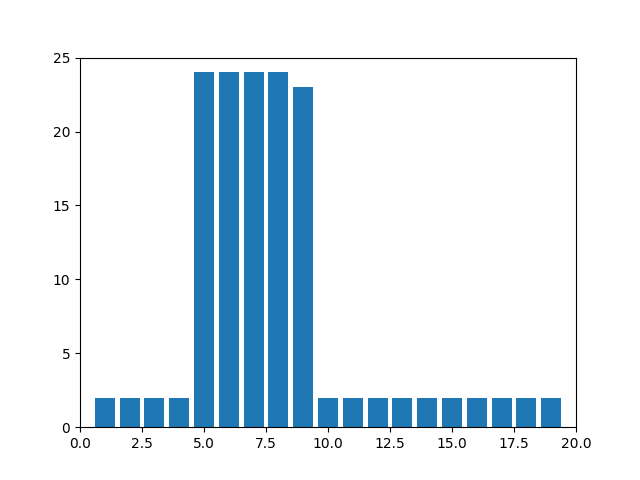| 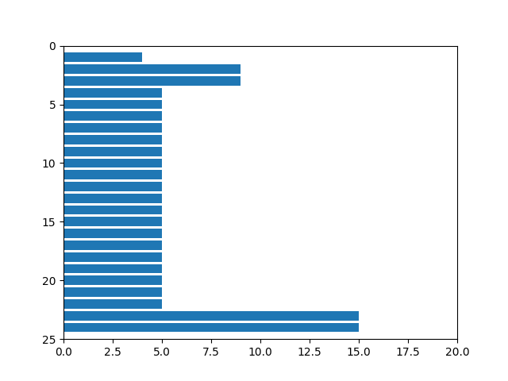|

|Признак|Значение|
|-------|--------|
|Вес чёрного|287|
|Нормированный вес чёрного|304.3939393939394|
|Центр масс|(3774.0, 5028.0)|
|Нормированный центр масс|(13.192307692307692, 17.576923076923077)|
|Моменты инерции|(7205140106.0, 4059346936.0)|
|Нормированные моменты инерции|(3113716.554019015, 1754255.3742437337)|

### Буква ւ
|Символ|Профиль по х|Профиль по y|
|---------------------|--------------------------|--------------------------|
|| | |

|Признак|Значение|
|-------|--------|
|Вес чёрного|147|
|Нормированный вес чёрного|185.68421052631578|
|Центр масс|(1141.0, 1989.0)|
|Нормированный центр масс|(7.808219178082192, 13.616438356164384)|
|Моменты инерции|(573673146.0, 188783214.0)|
|Нормированные моменты инерции|(612244.552828175, 201476.21558164354)|

### Буква Փ
|Символ|Профиль по х|Профиль по y|
|---------------------|--------------------------|--------------------------|
|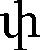| 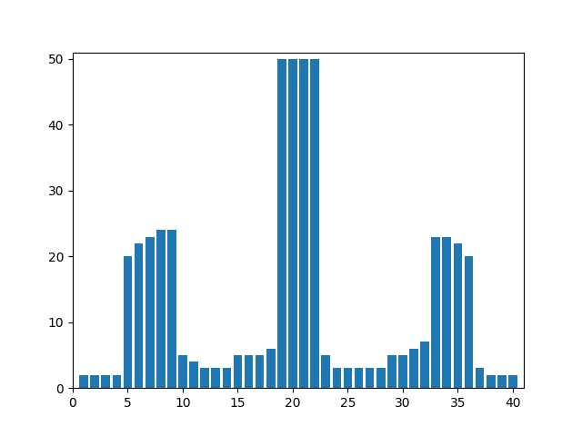| 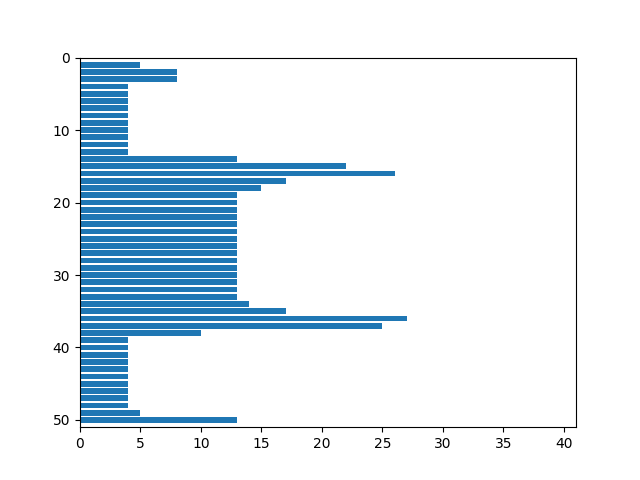|

|Признак|Значение|
|-------|--------|
|Вес чёрного|440|
|Нормированный вес чёрного|440.0|
|Центр масс|(7817.0, 7834.0)|
|Нормированный центр масс|(17.804100227790432, 17.842824601366743)|
|Моменты инерции|(26880919956.0, 26764381901.0)|
|Нормированные моменты инерции|(10971804.06367347, 10924237.510612246)|

### Буква փ
|Символ|Профиль по х|Профиль по y|
|---------------------|--------------------------|--------------------------|
|| | |

|Признак|Значение|
|-------|--------|
|Вес чёрного|500|
|Нормированный вес чёрного|625.0|
|Центр масс|(10066.0, 12925.0)|
|Нормированный центр масс|(20.170340681362724, 25.899799599198396)|
|Моменты инерции|(83194105157.0, 50459780048.0)|
|Нормированные моменты инерции|(20291245.160243902, 12307263.426341463)|

### Буква Ք
|Символ|Профиль по х|Профиль по y|
|---------------------|--------------------------|--------------------------|
|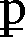| 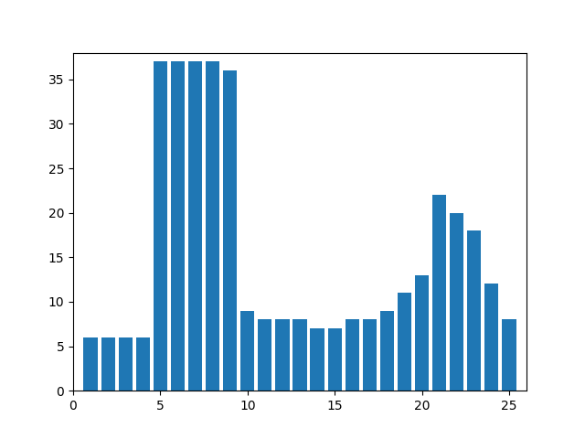| 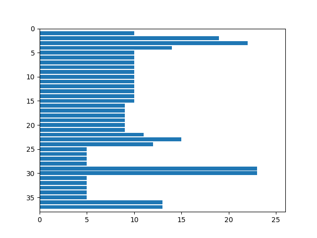|

|Признак|Значение|
|-------|--------|
|Вес чёрного|383|
|Нормированный вес чёрного|430.875|
|Центр масс|(6460.0, 7198.0)|
|Нормированный центр масс|(16.908376963350786, 18.840314136125656)|
|Моменты инерции|(19740243040.0, 15899874870.0)|
|Нормированные моменты инерции|(8508725.448275862, 6853394.3405172415)|

### Буква ք
|Символ|Профиль по х|Профиль по y|
|---------------------|--------------------------|--------------------------|
|| | |

|Признак|Значение|
|-------|--------|
|Вес чёрного|384|
|Нормированный вес чёрного|568.3199999999999|
|Центр масс|(4626.0, 6805.0)|
|Нормированный центр масс|(12.075718015665796, 17.765013054830288)|
|Моменты инерции|(17689833001.0, 8174826748.0)|
|Нормированные моменты инерции|(8871531.093781345, 4099712.511534604)|

### Буква Օ
|Символ|Профиль по х|Профиль по y|
|---------------------|--------------------------|--------------------------|
|| 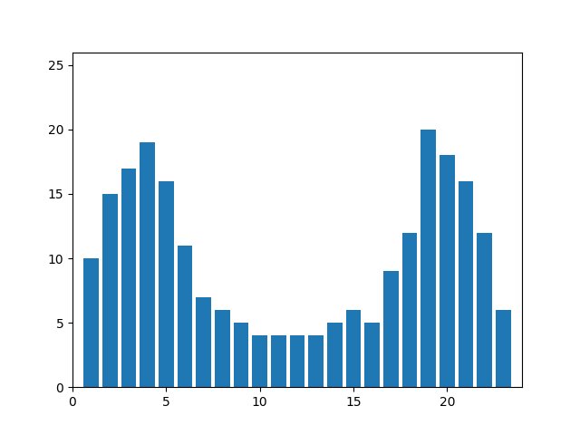| 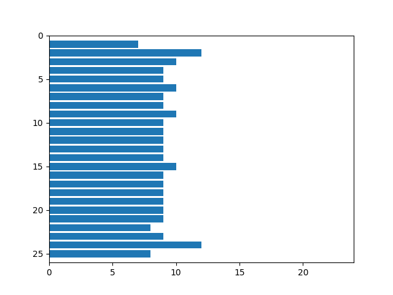|

|Признак|Значение|
|-------|--------|
|Вес чёрного|376|
|Нормированный вес чёрного|397.48571428571427|
|Центр масс|(6822.0, 7089.0)|
|Нормированный центр масс|(18.189333333333334, 18.901333333333334)|
|Моменты инерции|(18795144959.0, 17406020660.0)|
|Нормированные моменты инерции|(7245622.5747879725, 6710108.195836546)|

### Буква օ
|Символ|Профиль по х|Профиль по y|
|---------------------|--------------------------|--------------------------|
|| | |

|Признак|Значение|
|-------|--------|
|Вес чёрного|231|
|Нормированный вес чёрного|251.08695652173913|
|Центр масс|(2726.0, 2987.0)|
|Нормированный центр масс|(11.847826086956522, 12.982608695652173)|
|Моменты инерции|(2043227406.0, 1701761552.0)|
|Нормированные моменты инерции|(1770561.0103986135, 1474663.389948007)|

### Буква Ֆ
|Символ|Профиль по х|Профиль по y|
|---------------------|--------------------------|--------------------------|
|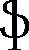| 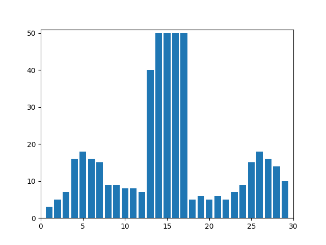| |

|Признак|Значение|
|-------|--------|
|Вес чёрного|432|
|Нормированный вес чёрного|486.0|
|Центр масс|(7196.0, 8379.0)|
|Нормированный центр масс|(16.693735498839906, 19.438515081206496)|
|Моменты инерции|(30189499037.0, 22266586666.0)|
|Нормированные моменты инерции|(13012715.102155173, 9597666.66637931)|

### Буква ֆ
|Символ|Профиль по х|Профиль по y|
|---------------------|--------------------------|--------------------------|
|| | |

|Признак|Значение|
|-------|--------|
|Вес чёрного|477|
|Нормированный вес чёрного|822.4137931034483|
|Центр масс|(7288.0, 11524.0)|
|Нормированный центр масс|(15.308823529411764, 24.20798319327731)|
|Моменты инерции|(63081584972.0, 25229731976.0)|
|Нормированные моменты инерции|(18881049.078718945, 7551551.0254414845)|
