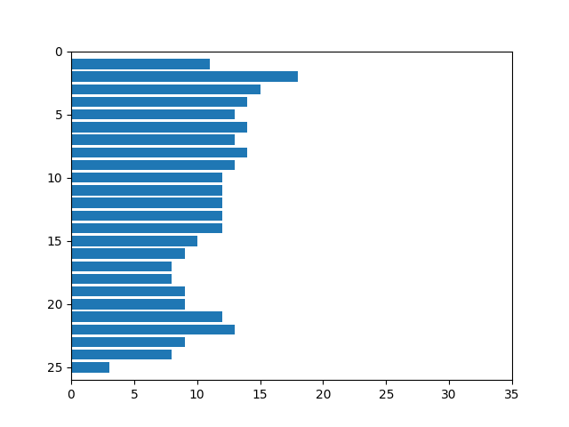

# Лабораторная работа №4

## Тема: Выделение признаков символов

|Студент:|Долидзе Александра|
|------------|--------------|
|Группа: |Б18-514     |
|Вариант:|Грузинский алфавит|
### Буква ქ
|Символ|Профиль по х|Профиль по y|
|---------------------|--------------------------|--------------------------|
|| | |

|Признак|Значение|
|-------|--------|
|Вес чёрного|393|
|Нормированный вес чёрного|0.2799145299145299|
|Центр масс|(19, 18)|
|Нормированный центр масс|(0.47368421052631576, 0.4857142857142857)|
|Моменты инерции|(54266, 50552)|
|Нормированные моменты инерции|(19.2637557685481, 17.945331913383033)|

### Буква წ
|Символ|Профиль по х|Профиль по y|
|---------------------|--------------------------|--------------------------|
|| | |

|Признак|Значение|
|-------|--------|
|Вес чёрного|414|
|Нормированный вес чёрного|0.40390243902439027|
|Центр масс|(19, 12)|
|Нормированный центр масс|(0.45, 0.4583333333333333)|
|Моменты инерции|(24710, 50097)|
|Нормированные моменты инерции|(10.715524718126627, 21.724631396357328)|

### Буква ე
|Символ|Профиль по х|Профиль по y|
|---------------------|--------------------------|--------------------------|
|| | |

|Признак|Значение|
|-------|--------|
|Вес чёрного|301|
|Нормированный вес чёрного|0.25336700336700335|
|Центр масс|(14, 17)|
|Нормированный центр масс|(0.40625, 0.45714285714285713)|
|Моменты инерции|(34468, 26294)|
|Нормированные моменты инерции|(14.451991614255766, 11.024737945492662)|

### Буква რ
|Символ|Профиль по х|Профиль по y|
|---------------------|--------------------------|--------------------------|
|| | |

|Признак|Значение|
|-------|--------|
|Вес чёрного|281|
|Нормированный вес чёрного|0.3301997649823737|
|Центр масс|(10, 15)|
|Нормированный центр масс|(0.4090909090909091, 0.3888888888888889)|
|Моменты инерции|(34471, 11292)|
|Нормированные моменты инерции|(18.161749209694417, 5.949420442571127)|

### Буква ტ
|Символ|Профиль по х|Профиль по y|
|---------------------|--------------------------|--------------------------|
|| | |

|Признак|Значение|
|-------|--------|
|Вес чёрного|342|
|Нормированный вес чёрного|0.2638888888888889|
|Центр масс|(17, 17)|
|Нормированный центр масс|(0.45714285714285713, 0.45714285714285713)|
|Моменты инерции|(35080, 33259)|
|Нормированные моменты инерции|(13.533950617283951, 12.831404320987655)|

### Буква ყ
|Символ|Профиль по х|Профиль по y|
|---------------------|--------------------------|--------------------------|
|| | |

|Признак|Значение|
|-------|--------|
|Вес чёрного|303|
|Нормированный вес чёрного|0.32756756756756755|
|Центр масс|(12, 16)|
|Нормированный центр масс|(0.4583333333333333, 0.4166666666666667)|
|Моменты инерции|(31310, 14902)|
|Нормированные моменты инерции|(15.70210631895687, 7.473420260782347)|

### Буква უ
|Символ|Профиль по х|Профиль по y|
|---------------------|--------------------------|--------------------------|
|| | |

|Признак|Значение|
|-------|--------|
|Вес чёрного|287|
|Нормированный вес чёрного|0.22777777777777777|
|Центр масс|(19, 16)|
|Нормированный центр масс|(0.5294117647058824, 0.42857142857142855)|
|Моменты инерции|(34210, 28523)|
|Нормированные моменты инерции|(13.570011900039667, 11.314161047203491)|

### Буква ი
|Символ|Профиль по х|Профиль по y|
|---------------------|--------------------------|--------------------------|
|| | |

|Признак|Значение|
|-------|--------|
|Вес чёрного|328|
|Нормированный вес чёрного|0.3166023166023166|
|Центр масс|(14, 15)|
|Нормированный центр масс|(0.48148148148148145, 0.3888888888888889)|
|Моменты инерции|(35145, 18355)|
|Нормированные моменты инерции|(16.323734324198792, 8.525313516024152)|

### Буква ო
|Символ|Профиль по х|Профиль по y|
|---------------------|--------------------------|--------------------------|
|| | |

|Признак|Значение|
|-------|--------|
|Вес чёрного|302|
|Нормированный вес чёрного|0.2621527777777778|
|Центр масс|(14, 18)|
|Нормированный центр масс|(0.41935483870967744, 0.4857142857142857)|
|Моменты инерции|(35813, 26060)|
|Нормированные моменты инерции|(15.436637931034483, 11.232758620689655)|

### Буква პ
|Символ|Профиль по х|Профиль по y|
|---------------------|--------------------------|--------------------------|
|| | |

|Признак|Значение|
|-------|--------|
|Вес чёрного|277|
|Нормированный вес чёрного|0.28036437246963564|
|Центр масс|(11, 21)|
|Нормированный центр масс|(0.4, 0.5405405405405406)|
|Моменты инерции|(35455, 10944)|
|Нормированные моменты инерции|(16.724056603773583, 5.162264150943396)|

### Буква ა
|Символ|Профиль по х|Профиль по y|
|---------------------|--------------------------|--------------------------|
|| | |

|Признак|Значение|
|-------|--------|
|Вес чёрного|372|
|Нормированный вес чёрного|0.33513513513513515|
|Центр масс|(15, 19)|
|Нормированный центр масс|(0.4827586206896552, 0.5)|
|Моменты инерции|(44127, 28745)|
|Нормированные моменты инерции|(19.44777434993389, 12.66857646540326)|

### Буква ს
|Символ|Профиль по х|Профиль по y|
|---------------------|--------------------------|--------------------------|
|| | |

|Признак|Значение|
|-------|--------|
|Вес чёрного|287|
|Нормированный вес чёрного|0.31027027027027027|
|Центр масс|(12, 16)|
|Нормированный центр масс|(0.4583333333333333, 0.4166666666666667)|
|Моменты инерции|(29343, 13972)|
|Нормированные моменты инерции|(14.715646940822467, 7.007021063189569)|

### Буква დ
|Символ|Профиль по х|Профиль по y|
|---------------------|--------------------------|--------------------------|
|| | |

|Признак|Значение|
|-------|--------|
|Вес чёрного|270|
|Нормированный вес чёрного|0.25|
|Центр масс|(12, 18)|
|Нормированный центр масс|(0.4230769230769231, 0.4358974358974359)|
|Моменты инерции|(38948, 13659)|
|Нормированные моменты инерции|(16.7230571060541, 5.864748819235723)|

### Буква ფ
|Символ|Профиль по х|Профиль по y|
|---------------------|--------------------------|--------------------------|
|| | |

|Признак|Значение|
|-------|--------|
|Вес чёрного|232|
|Нормированный вес чёрного|0.23015873015873015|
|Центр масс|(9, 20)|
|Нормированный центр масс|(0.34782608695652173, 0.4634146341463415)|
|Моменты инерции|(35075, 6641)|
|Нормированные моменты инерции|(14.989316239316238, 2.838034188034188)|

### Буква გ
|Символ|Профиль по х|Профиль по y|
|---------------------|--------------------------|--------------------------|
|| | |

|Признак|Значение|
|-------|--------|
|Вес чёрного|289|
|Нормированный вес чёрного|0.2744539411206078|
|Центр масс|(11, 18)|
|Нормированный центр масс|(0.38461538461538464, 0.4473684210526316)|
|Моменты инерции|(44925, 26708)|
|Нормированные моменты инерции|(19.966666666666665, 11.870222222222223)|

### Буква ჰ
|Символ|Профиль по х|Профиль по y|
|---------------------|--------------------------|--------------------------|
|| | |

|Признак|Значение|
|-------|--------|
|Вес чёрного|340|
|Нормированный вес чёрного|0.34034034034034033|
|Центр масс|(12, 16)|
|Нормированный центр масс|(0.4230769230769231, 0.4166666666666667)|
|Моменты инерции|(40572, 16757)|
|Нормированные моменты инерции|(19.338417540514776, 7.987130600571973)|

### Буква ჯ
|Символ|Профиль по х|Профиль по y|
|---------------------|--------------------------|--------------------------|
|| | |

|Признак|Значение|
|-------|--------|
|Вес чёрного|444|
|Нормированный вес чёрного|0.3008130081300813|
|Центр масс|(19, 17)|
|Нормированный центр масс|(0.45, 0.45714285714285713)|
|Моменты инерции|(42031, 49796)|
|Нормированные моменты инерции|(14.118575747396708, 16.726906281491434)|

### Буква კ
|Символ|Профиль по х|Профиль по y|
|---------------------|--------------------------|--------------------------|
|| | |

|Признак|Значение|
|-------|--------|
|Вес чёрного|407|
|Нормированный вес чёрного|0.3548387096774194|
|Центр масс|(13, 15)|
|Нормированный центр масс|(0.4, 0.3888888888888889)|
|Моменты инерции|(40303, 25248)|
|Нормированные моменты инерции|(17.297424892703862, 10.836051502145922)|

### Буква ლ
|Символ|Профиль по х|Профиль по y|
|---------------------|--------------------------|--------------------------|
|| | |

|Признак|Значение|
|-------|--------|
|Вес чёрного|355|
|Нормированный вес чёрного|0.28174603174603174|
|Центр масс|(16, 18)|
|Нормированный центр масс|(0.4411764705882353, 0.4857142857142857)|
|Моменты инерции|(37153, 33840)|
|Нормированные моменты инерции|(14.737405791352638, 13.423244744149148)|

### Буква ზ
|Символ|Профиль по х|Профиль по y|
|---------------------|--------------------------|--------------------------|
|| | |

|Признак|Значение|
|-------|--------|
|Вес чёрного|301|
|Нормированный вес чёрного|0.30465587044534415|
|Центр масс|(12, 20)|
|Нормированный центр масс|(0.44, 0.5135135135135135)|
|Моменты инерции|(32709, 15935)|
|Нормированные моменты инерции|(15.42877358490566, 7.5165094339622645)|

### Буква ხ
|Символ|Профиль по х|Профиль по y|
|---------------------|--------------------------|--------------------------|
|| | |

|Признак|Значение|
|-------|--------|
|Вес чёрного|284|
|Нормированный вес чёрного|0.2798029556650246|
|Центр масс|(12, 16)|
|Нормированный центр масс|(0.39285714285714285, 0.4411764705882353)|
|Моменты инерции|(28845, 19835)|
|Нормированные моменты инерции|(13.961761858664085, 9.600677637947726)|

### Буква ც
|Символ|Профиль по х|Профиль по y|
|---------------------|--------------------------|--------------------------|
|| | |

|Признак|Значение|
|-------|--------|
|Вес чёрного|355|
|Нормированный вес чёрного|0.26296296296296295|
|Центр масс|(11, 24)|
|Нормированный центр масс|(0.38461538461538464, 0.46938775510204084)|
|Моменты инерции|(62369, 15825)|
|Нормированные моменты инерции|(19.315267884794054, 4.900898110870238)|

### Буква ვ
|Символ|Профиль по х|Профиль по y|
|---------------------|--------------------------|--------------------------|
|| | |

|Признак|Значение|
|-------|--------|
|Вес чёрного|219|
|Нормированный вес чёрного|0.20277777777777778|
|Центр масс|(10, 20)|
|Нормированный центр масс|(0.34615384615384615, 0.48717948717948717)|
|Моменты инерции|(37115, 9260)|
|Нормированные моменты инерции|(15.936024044654358, 3.9759553456419066)|

### Буква ბ
|Символ|Профиль по х|Профиль по y|
|---------------------|--------------------------|--------------------------|
|| | |

|Признак|Значение|
|-------|--------|
|Вес чёрного|167|
|Нормированный вес чёрного|0.2375533428165007|
|Центр масс|(6, 18)|
|Нормированный центр масс|(0.2777777777777778, 0.4722222222222222)|
|Моменты инерции|(22616, 1043)|
|Нормированные моменты инерции|(13.072832369942196, 0.6028901734104046)|

### Буква ნ
|Символ|Профиль по х|Профиль по y|
|---------------------|--------------------------|--------------------------|
|| | |

|Признак|Значение|
|-------|--------|
|Вес чёрного|393|
|Нормированный вес чёрного|0.3119047619047619|
|Центр масс|(16, 18)|
|Нормированный центр масс|(0.42857142857142855, 0.5)|
|Моменты инерции|(36953, 46378)|
|Нормированные моменты инерции|(14.658072193573979, 18.396667988893295)|

### Буква მ
|Символ|Профиль по х|Профиль по y|
|---------------------|--------------------------|--------------------------|
|| | |

|Признак|Значение|
|-------|--------|
|Вес чёрного|485|
|Нормированный вес чёрного|0.24871794871794872|
|Центр масс|(16, 25)|
|Нормированный центр масс|(0.39473684210526316, 0.4897959183673469)|
|Моменты инерции|(69771, 56317)|
|Нормированные моменты инерции|(17.351653817458345, 14.005719970156678)|

### Буква ჭ
|Символ|Профиль по х|Профиль по y|
|---------------------|--------------------------|--------------------------|
|| | |

|Признак|Значение|
|-------|--------|
|Вес чёрного|408|
|Нормированный вес чёрного|0.28254847645429365|
|Центр масс|(18, 17)|
|Нормированный центр масс|(0.4594594594594595, 0.43243243243243246)|
|Моменты инерции|(51367, 52550)|
|Нормированные моменты инерции|(17.786357340720222, 18.195983379501385)|

### Буква ღ
|Символ|Профиль по х|Профиль по y|
|---------------------|--------------------------|--------------------------|
|| | |

|Признак|Значение|
|-------|--------|
|Вес чёрного|310|
|Нормированный вес чёрного|0.3708133971291866|
|Центр масс|(10, 21)|
|Нормированный центр масс|(0.42857142857142855, 0.5405405405405406)|
|Моменты инерции|(30105, 12414)|
|Нормированные моменты инерции|(15.614626556016598, 6.4387966804979255)|

### Буква თ
|Символ|Профиль по х|Профиль по y|
|---------------------|--------------------------|--------------------------|
|| | |

|Признак|Значение|
|-------|--------|
|Вес чёрного|313|
|Нормированный вес чёрного|0.2630252100840336|
|Центр масс|(18, 16)|
|Нормированный центр масс|(0.5151515151515151, 0.4411764705882353)|
|Моменты инерции|(31007, 27827)|
|Нормированные моменты инерции|(13.022679546409071, 11.687106257874843)|

### Буква შ
|Символ|Профиль по х|Профиль по y|
|---------------------|--------------------------|--------------------------|
|| | |

|Признак|Значение|
|-------|--------|
|Вес чёрного|388|
|Нормированный вес чёрного|0.27714285714285714|
|Центр масс|(14, 26)|
|Нормированный центр масс|(0.48148148148148145, 0.5102040816326531)|
|Моменты инерции|(66492, 20151)|
|Нормированные моменты инерции|(20.247259439707673, 6.136114494518879)|

### Буква ჟ
|Символ|Профиль по х|Профиль по y|
|---------------------|--------------------------|--------------------------|
|| | |

|Признак|Значение|
|-------|--------|
|Вес чёрного|226|
|Нормированный вес чёрного|0.21523809523809523|
|Центр масс|(13, 24)|
|Нормированный центр масс|(0.5, 0.5609756097560976)|
|Моменты инерции|(37100, 7987)|
|Нормированные моменты инерции|(15.52951025533696, 3.3432398493093345)|

### Буква ძ
|Символ|Профиль по х|Профиль по y|
|---------------------|--------------------------|--------------------------|
|| | |

|Признак|Значение|
|-------|--------|
|Вес чёрного|315|
|Нормированный вес чёрного|0.3153153153153153|
|Центр масс|(12, 21)|
|Нормированный центр масс|(0.4230769230769231, 0.5555555555555556)|
|Моменты инерции|(36905, 15298)|
|Нормированные моменты инерции|(17.590562440419447, 7.291706387035272)|

### Буква ჩ
|Символ|Профиль по х|Профиль по y|
|---------------------|--------------------------|--------------------------|
|| | |

|Признак|Значение|
|-------|--------|
|Вес чёрного|361|
|Нормированный вес чёрного|0.3364398881640261|
|Центр масс|(15, 20)|
|Нормированный центр масс|(0.5, 0.5277777777777778)|
|Моменты инерции|(49202, 27597)|
|Нормированные моменты инерции|(22.263348416289592, 12.487330316742081)|
