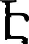

## Оценка близости для размера шрифта 52

### Буква 0

 

## Лучшие гипотезы: 

| Буква | Близость |
| :---: | :---: |
|ւ|85.29564565447657|
|չ|82.55475590471411|
|լ|82.19372701605367|
|օ|81.33287441979131|
|յ|80.98977813533965|
|Ն|80.89358098502171|
|ս|80.63246640742089|
|ձ|80.52598760622742|
|Ւ|80.10835676008477|
|տ|79.97617283958749|
|է|79.58950611862171|
|Վ|79.37223331380731|
|ա|79.13694336067537|
|ո|79.12115798681054|
|Հ|78.90425559626601|
|Կ|78.75278988421935|
|զ|78.44646481973885|
|Ի|78.40036589046883|
|Ր|78.33256425662645|
|ռ|78.32890244376051|
|Դ|78.31832883617214|
|Լ|78.30014995559472|
|Գ|77.97654325669154|
|ծ|77.77387031479923|
|ժ|77.61041930580309|
|Բ|77.54210594517346|
|գ|77.36387921221711|
|ե|77.15017974633886|
|մ|77.12379529913969|
|Է|76.91440867449442|
|Ժ|76.66702648820912|
|Թ|76.56438868500263|
|Ե|76.53746698071627|
|դ|76.45092677044582|
|վ|76.14223046503646|
|պ|76.03887416009188|
|Պ|75.98065178898405|
|ճ|75.90688320167584|
|Խ|75.72898631695948|
|հ|75.62872455312485|
|ջ|75.60308340873956|
|շ|75.54688417178849|
|բ|75.53071107331068|
|ն|75.52452026139868|
|ր|75.25654438449425|
|Ք|75.16099814294293|
|Փ|74.98835151225131|
|փ|74.8714001361832|
|թ|74.85302409577939|
|ի|74.81192958148758|
|Ռ|74.79880324634527|
|խ|73.98915519144758|
|Չ|73.9671272255452|
|Ց|73.77932270251401|
|ը|73.7503607468108|
|Ո|73.72183757798784|
|Տ|73.56042357294407|
|կ|73.50662638195169|
|Մ|73.4459794670951|
|Ճ|73.43955102675038|
|Ջ|73.1670198900661|
|Ս|73.01222202406777|
|Ծ|72.68609101537798|
|Օ|72.68135806518617|
|Յ|72.31286408432474|
|Զ|72.29020575113111|
|Շ|72.27502047843336|
|Ը|72.00249750112428|
|Ա|71.28117542929807|
|ց|70.23924962395726|
|Ֆ|70.03081459892925|
|Ձ|69.62461974624753|
|ք|69.3992467343537|
|ֆ|69.02745408324827|

### Буква 1

 

## Лучшие гипотезы: 

| Буква | Близость |
| :---: | :---: |
|ւ|64.83506131781515|
|լ|63.256410762759465|
|չ|62.93331869189534|
|յ|62.554366538441094|
|է|60.31363801077744|
|ձ|59.71089522691503|
|Հ|59.581710701061084|
|Լ|58.83376501296527|
|Ն|57.49305498897857|
|Ւ|57.48510773758382|
|ե|57.41488334491161|
|զ|57.29707275015368|
|ս|57.28109902292099|
|օ|57.23912168513808|
|ծ|57.13737682370482|
|շ|56.91689409517412|
|Է|56.86927809613346|
|Ր|56.83949925424133|
|Վ|56.62673677528935|
|վ|56.609997419855524|
|ժ|56.44341846629548|
|գ|56.29608086711471|
|ի|56.0401324957429|
|մ|55.9974654288277|
|ջ|55.967437162264424|
|բ|55.90485171544808|
|Ի|55.898981034020174|
|ո|55.6123912169515|
|ճ|55.56056196150099|
|հ|55.215440390885625|
|դ|55.09494475721184|
|Կ|55.08369771600515|
|Դ|54.95295899751143|
|ր|54.68189964192972|
|ն|54.62245475982638|
|Բ|54.535464667913175|
|կ|54.492694282112666|
|ռ|54.08956541077384|
|Գ|53.92306610657717|
|Ե|53.70018943413623|
|ը|53.576144223627246|
|Տ|53.31348903946914|
|Պ|53.18580668430733|
|Ց|52.97703636901626|
|Չ|52.94507644493701|
|թ|52.72159129860222|
|Ք|52.66005621034549|
|Ժ|52.64419496087534|
|փ|52.24159206184063|
|Ճ|51.73761691192874|
|ֆ|51.45233780280805|
|տ|51.40166969378241|
|Շ|51.348578848060214|
|Յ|51.239558983678265|
|Թ|50.87517859504807|
|Ջ|50.674410761177484|
|ա|50.54694746444538|
|խ|50.3769011944979|
|Ը|50.18112718774998|
|Փ|50.11965909386774|
|ք|50.07569009577484|
|Զ|49.921370274422735|
|ց|49.87982595874894|
|Ո|49.810209515272334|
|Խ|49.38461576901528|
|պ|49.297738966993876|
|Ռ|49.24696022342277|
|Ս|49.190813111569916|
|Ֆ|48.7588799274205|
|Մ|48.55447832265978|
|Ձ|48.23549471650628|
|Ծ|47.15560409862385|
|Ա|46.24717483255662|
|Օ|45.54848086182068|

### Буква 2

 

## Лучшие гипотезы: 

| Буква | Близость |
| :---: | :---: |
|ւ|62.63997920294676|
|լ|61.10511089442301|
|չ|60.764898595144764|
|յ|60.41966364555713|
|է|58.16395533877596|
|ձ|57.52271005859898|
|Հ|57.43360891132482|
|Լ|56.684646316950065|
|ե|55.26408596926234|
|Ւ|55.26124504148028|
|Ն|55.25283944835997|
|զ|55.10877400103631|
|ս|55.04243400533102|
|օ|54.986246024042785|
|ծ|54.96301160540578|
|շ|54.800858818252244|
|Է|54.712074348656145|
|Ր|54.64416190616524|
|վ|54.46851490488984|
|Վ|54.40265349489391|
|ժ|54.257775555603544|
|գ|54.1135690584434|
|ի|53.92407494030642|
|ջ|53.82588131396653|
|մ|53.81455942384506|
|բ|53.76386630822143|
|Ի|53.6826112969208|
|ճ|53.40051476252847|
|ո|53.374882471148084|
|հ|53.055014277187276|
|դ|52.909530106757586|
|Կ|52.84428974572126|
|Դ|52.72026165336893|
|ր|52.51929653176271|
|ն|52.45106078468262|
|կ|52.37710068735987|
|Բ|52.31187746020593|
|ռ|51.841423232947285|
|Գ|51.67898870706536|
|Ե|51.48318899471554|
|ը|51.43011867530825|
|Տ|51.16660520210679|
|Պ|50.971570006568676|
|Ց|50.81571391184026|
|Չ|50.77770008422458|
|թ|50.52545816288819|
|Ք|50.45485096695814|
|Ժ|50.40430889704134|
|փ|50.03476426588453|
|Ճ|49.55691940182561|
|ֆ|49.403198727255116|
|Շ|49.19154587026687|
|տ|49.10090482354585|
|Յ|49.07881885750135|
|Թ|48.608391822545684|
|Ջ|48.47731470794402|
|ա|48.24663642423167|
|խ|48.15337930154035|
|Ը|48.00429435269076|
|ք|47.97588898267915|
|Փ|47.86986097987374|
|ց|47.747855120469055|
|Զ|47.73080399772888|
|Ո|47.581803479531764|
|Խ|47.11045040412498|
|պ|47.01785963342969|
|Ռ|46.98650246357592|
|Ս|46.96673505055913|
|Ֆ|46.6052948010268|
|Մ|46.30890001506511|
|Ձ|46.08130411085991|
|Ծ|44.90140295874898|
|Ա|44.00630301821285|
|Օ|43.270405687893096|

### Буква 3

 

## Лучшие гипотезы: 

| Буква | Близость |
| :---: | :---: |
|ւ|108.9630321365753|
|լ|108.81352337182537|
|յ|108.58358164568705|
|չ|108.03304038962965|
|է|106.10530683868969|
|Հ|105.46355734519534|
|Լ|104.73994466379823|
|ձ|104.44322631472527|
|շ|103.73651957053532|
|ե|103.37654295519012|
|ի|102.91592367773251|
|վ|102.86092910941375|
|Է|102.70405809750626|
|ծ|102.48151966070947|
|ջ|102.26108264061094|
|բ|102.21677619264544|
|զ|102.21436992588993|
|Ր|101.57215378471204|
|ժ|101.51045378247684|
|կ|101.48076749958898|
|գ|101.46858893774403|
|ճ|101.41732317718159|
|մ|101.18233792443903|
|Ւ|101.15213710667318|
|հ|101.08827436455555|
|ր|100.53792609039135|
|Ն|100.47268870572123|
|Վ|100.36350604530396|
|ս|100.34960148835982|
|դ|100.27844709453908|
|ն|100.24624033789873|
|Ի|99.99311989797347|
|ը|99.93511844349965|
|ֆ|99.8837713367726|
|Տ|99.67154169417594|
|օ|99.63359189372265|
|Ց|99.00016253117951|
|ո|98.89360032985394|
|Չ|98.81233898290655|
|Դ|98.50338035741771|
|Բ|98.48705573476155|
|Կ|98.33591805768232|
|Ե|97.97503765267332|
|թ|97.78246590341982|
|ք|97.68711172990876|
|Շ|97.61066546030604|
|Պ|97.60744788983548|
|Ք|97.43734558891047|
|Յ|97.41757280803354|
|Ճ|97.34167224645141|
|Գ|97.08609446119279|
|ռ|97.04503164087532|
|փ|97.00468286728673|
|ց|96.84263723715036|
|Ժ|96.12671697414598|
|Ը|96.02789067402736|
|Ջ|95.89333679989927|
|Զ|95.40547917909933|
|Ֆ|95.3184284898582|
|Ձ|94.82512496610462|
|խ|94.74412573173167|
|Ո|94.05580470315694|
|Ս|93.66217050158339|
|Փ|93.43849283800093|
|Թ|93.22546000539211|
|Մ|92.24552717809259|
|Ռ|92.14721210595035|
|Խ|91.47217458851767|
|պ|91.00371133400643|
|Ծ|90.62610630752899|
|տ|90.47739482036769|
|Ա|90.41028498036403|
|ա|89.8478616466102|
|Օ|87.91181275303916|

### Буква 4

 

## Лучшие гипотезы: 

| Буква | Близость |
| :---: | :---: |
|ւ|66.27272242192532|
|լ|64.71181490334041|
|չ|64.38263796993687|
|յ|64.0147733708172|
|է|61.76951498371031|
|ձ|61.151791441034554|
|Հ|61.038084553838985|
|Լ|60.289792579573735|
|Ւ|58.90598377249419|
|Ն|58.90174982042823|
|ե|58.870333078814305|
|զ|58.73787037242606|
|ս|58.69102765618276|
|օ|58.63636519512863|
|ծ|58.58421825691141|
|շ|58.38201238685133|
|Է|58.32256622529427|
|Ր|58.27690724980923|
|վ|58.06834276295691|
|Վ|58.047459507947615|
|ժ|57.88541857747759|
|գ|57.73946827231753|
|ի|57.5052274568436|
|մ|57.440678005875455|
|ջ|57.425728441247436|
|բ|57.363313616199974|
|Ի|57.324681567366994|
|ո|57.02322298000572|
|ճ|57.01281665580068|
|հ|56.66755036975245|
|դ|56.53701291445441|
|Կ|56.493031468948544|
|Դ|56.36753617679366|
|ր|56.133204037087204|
|ն|56.070433108605684|
|կ|55.95786173097348|
|Բ|55.95649267634025|
|ռ|55.49129231297387|
|Գ|55.32846702854981|
|Ե|55.12546829696288|
|ը|55.03301009623759|
|Տ|54.7700833179655|
|Պ|54.61277113785593|
|Ց|54.42876699069839|
|Չ|54.39457477145288|
|թ|54.15849656619082|
|Ք|54.09221256214364|
|Ժ|54.05311726099294|
|փ|53.67285159425347|
|Ճ|53.1816880849907|
|ֆ|52.9287737052172|
|Շ|52.801770428867314|
|տ|52.70897173041342|
|Յ|52.69144540703743|
|Թ|52.25708841577069|
|Ջ|52.1107960339295|
|ա|51.85659116741309|
|խ|51.797909776128705|
|Ը|51.626788742895606|
|ք|51.54415155931031|
|Փ|51.519865834831|
|Զ|51.360931784900934|
|ց|51.34068218379665|
|Ո|51.22784830350016|
|Խ|50.75663628871779|
|պ|50.660862229023685|
|Ռ|50.63632677573266|
|Ս|50.611427536033965|
|Ֆ|50.21315908878134|
|Մ|49.95853048023463|
|Ձ|49.68955994779233|
|Ծ|48.55155702404446|
|Ա|47.6552313779897|
|Օ|46.91466797621629|

### Буква 5

 

## Лучшие гипотезы: 

| Буква | Близость |
| :---: | :---: |
|ւ|109.63254393127701|
|լ|109.41696715865044|
|յ|109.16365394899772|
|չ|108.65556492050551|
|է|106.68928946376296|
|Հ|106.0411953053387|
|Լ|105.31409888071602|
|ձ|105.07092259782294|
|շ|104.26278275952345|
|ե|103.94356385134687|
|ի|103.43674078678166|
|վ|103.41231775855937|
|Է|103.2748417730465|
|ծ|103.07448932189966|
|զ|102.8259283894632|
|ջ|102.80838602580558|
|բ|102.76304428121836|
|Ր|102.189719566062|
|ժ|102.1126850894407|
|գ|102.0658537252447|
|կ|101.99122730406873|
|ճ|101.98260437193719|
|Ւ|101.81486783948253|
|մ|101.77799926850784|
|հ|101.65163686757579|
|Ն|101.16186274461272|
|ր|101.1001127672697|
|ս|101.03457418787065|
|Վ|101.02020613375856|
|դ|100.87085168152178|
|ն|100.81824478102621|
|Ի|100.63295179287898|
|ը|100.47116772035652|
|օ|100.34354135812579|
|ֆ|100.31349141610013|
|Տ|100.20668913389147|
|ո|99.56381789557739|
|Ց|99.5488361848094|
|Չ|99.3676480534641|
|Դ|99.16063547086418|
|Բ|99.12709986803095|
|Կ|99.00506533889238|
|Ե|98.59899932401996|
|թ|98.37083224323277|
|Պ|98.22349436981885|
|ք|98.15281643166817|
|Շ|98.14276371764724|
|Ք|98.03701172671406|
|Յ|97.95292109203743|
|Ճ|97.90355004881916|
|Գ|97.7537171759453|
|ռ|97.72108730730109|
|փ|97.6032161911303|
|ց|97.33786153443056|
|Ժ|96.77682080743922|
|Ը|96.57328650563552|
|Ջ|96.46689276648921|
|Զ|95.96498393724784|
|Ֆ|95.82733129754443|
|խ|95.35039357084152|
|Ձ|95.33059386743301|
|Ո|94.66424992981737|
|Ս|94.25907746998897|
|Փ|94.08325444799443|
|Թ|93.90873596706341|
|Մ|92.8690716848942|
|Ռ|92.80296851886823|
|Խ|92.15720261903611|
|պ|91.70133777833665|
|տ|91.27133242803049|
|Ծ|91.25081362607116|
|Ա|91.00488336777711|
|ա|90.63009721488157|
|Օ|88.56675534380155|

### Буква 6

 

## Лучшие гипотезы: 

| Буква | Близость |
| :---: | :---: |
|տ|72.84329433658198|
|ա|72.15325318335121|
|ւ|71.07419605154737|
|օ|70.39851708887392|
|Ն|69.50168022443049|
|ս|69.24450668004168|
|Ւ|68.2586303914092|
|չ|68.12976135603341|
|ո|68.10247164993694|
|պ|68.08333318915719|
|ռ|68.00352274216814|
|Կ|67.91893730525547|
|Վ|67.73556253069395|
|Թ|67.67929223342496|
|Գ|67.57068976054575|
|Խ|67.51474648762061|
|լ|67.33891721916365|
|Դ|67.32875432778579|
|ձ|67.27427101896289|
|Ի|66.74664552527112|
|Ժ|66.47159380619965|
|Բ|66.41795257597192|
|Ռ|66.13602820169667|
|յ|65.96453044876468|
|Ր|65.9427989844602|
|զ|65.78385718791517|
|Փ|65.75719269160571|
|Օ|65.68652143587003|
|Ե|65.46687496874911|
|է|65.3828277269791|
|ժ|65.10628375262213|
|Պ|64.98068237515753|
|ծ|64.85317808212908|
|Հ|64.84374061453396|
|գ|64.83050321798743|
|մ|64.67607544181062|
|Մ|64.53570770247656|
|Լ|64.44510889864377|
|Ծ|64.42602436456895|
|դ|64.29383694557555|
|Ք|64.09519780146441|
|Ո|64.00379444043699|
|խ|63.990361080643304|
|փ|63.958204953922376|
|Է|63.7174988265864|
|ե|63.68773530257192|
|թ|63.57083278147559|
|Ս|63.369050113261125|
|ն|63.206211119100914|
|ճ|63.11161968347569|
|հ|62.93412061617957|
|Ա|62.931412977179285|
|ր|62.74975534609939|
|վ|62.71526996908746|
|Ջ|62.4888381296745|
|ջ|62.350245147823095|
|բ|62.28434624337433|
|Ճ|62.117537233397094|
|Չ|62.03761740285351|
|Ց|61.725808557585644|
|Զ|61.700947591142594|
|շ|61.58453559278693|
|ը|61.244345934868726|
|Տ|61.14510918915141|
|ի|61.089235823752226|
|Ը|61.06682232848273|
|Յ|60.757921864634106|
|Շ|60.62071482692679|
|կ|60.21105346349607|
|Ֆ|59.11956278556632|
|Ձ|58.892761590778974|
|ց|58.60998698620308|
|ք|57.20719507135894|
|ֆ|55.66398655063231|

### Буква 7

 

## Лучшие гипотезы: 

| Буква | Близость |
| :---: | :---: |
|ւ|110.8031930137665|
|լ|110.6466233569125|
|յ|110.41367385695342|
|չ|109.8683998962027|
|է|107.93586156724211|
|Հ|107.29325142933642|
|Լ|106.56913419882842|
|ձ|106.27912077177129|
|շ|105.558485987268|
|ե|105.20471057170721|
|ի|104.73697287602208|
|վ|104.68680528560925|
|Է|104.53274511681455|
|ծ|104.31320159794492|
|ջ|104.08632352844998|
|զ|104.04836594734203|
|բ|104.04185867527697|
|Ր|103.40684085778983|
|ժ|103.34329475321421|
|գ|103.30080429108979|
|կ|103.30005333053|
|ճ|103.24520823118748|
|մ|103.01434611947977|
|Ւ|102.99157664544892|
|հ|102.91587364286845|
|ր|102.36534045834662|
|Ն|102.3144166074906|
|Վ|102.20237247965252|
|ս|102.1909955458381|
|դ|102.11001576547964|
|ն|102.0750526852904|
|Ի|101.83026476826728|
|ը|101.75856440838022|
|ֆ|101.68770059712274|
|Տ|101.49484181703289|
|օ|101.47685784478803|
|Ց|100.82554609057688|
|ո|100.73370562240649|
|Չ|100.63871461627343|
|Դ|100.34227193011043|
|Բ|100.32419884717396|
|Կ|100.17592102063098|
|Ե|99.81040705072299|
|թ|99.61345126496975|
|ք|99.49818751215265|
|Պ|99.44189761971454|
|Շ|99.43342358091903|
|Ք|99.26979096624545|
|Յ|99.24085424574739|
|Ճ|99.16897547861655|
|Գ|98.92593745201701|
|ռ|98.88563089861043|
|փ|98.83697182623591|
|ց|98.65915702552573|
|Ժ|97.96486271383762|
|Ը|97.85269426999497|
|Ջ|97.72227598499197|
|Զ|97.23239557085141|
|Ֆ|97.13729297154832|
|Ձ|96.64338425748677|
|խ|96.57733155063276|
|Ո|95.88926995231517|
|Ս|95.49418211061246|
|Փ|95.27605119424976|
|Թ|95.06661569765338|
|Մ|94.0807412192888|
|Ռ|93.98585189641229|
|Խ|93.31344888522025|
|պ|92.84598178758804|
|Ծ|92.46142247008822|
|տ|92.32444266273998|
|Ա|92.24192767883123|
|ա|91.6946006607949|
|Օ|89.75029746336341|

### Буква 8

 

## Лучшие гипотезы: 

| Буква | Близость |
| :---: | :---: |
|ւ|37.187194950106424|
|տ|37.10246872161237|
|ա|36.43534511255585|
|օ|34.95305465658171|
|չ|34.34391989542771|
|Ն|34.18140030116416|
|ս|33.91942963310635|
|լ|33.85929872177263|
|Ւ|33.08065911338842|
|ձ|32.73521003217037|
|ո|32.64787717757739|
|յ|32.60391653031191|
|Վ|32.47157523135494|
|Կ|32.412045601824474|
|ռ|32.38206088645101|
|պ|32.30701680431531|
|Գ|31.95962224883823|
|Թ|31.888762764541283|
|Դ|31.85487117422102|
|Խ|31.726866210591098|
|Ի|31.471490416778387|
|է|31.4065126486992|
|Բ|30.967471346776836|
|Ր|30.94784377159301|
|զ|30.913001810147716|
|Ժ|30.807298949751072|
|Հ|30.760289618226306|
|Ռ|30.34040153547332|
|Լ|30.219929139709667|
|ժ|30.147956172014727|
|ծ|30.093802529775676|
|Օ|30.059608960973232|
|Ե|29.98640379041866|
|Փ|29.975776407289448|
|գ|29.88085198038551|
|մ|29.684190526330276|
|Պ|29.473944381775727|
|ե|29.206789638797883|
|դ|29.168648588735724|
|Է|29.084954405504302|
|Մ|28.740490183467017|
|Ծ|28.65080913950786|
|Ք|28.59204110248095|
|փ|28.4127799323921|
|խ|28.268762491176364|
|ճ|28.255267691405614|
|Ո|28.24959140743133|
|վ|28.19581935985344|
|ն|28.12819531113864|
|թ|28.12046396751424|
|հ|28.024300565395556|
|ր|27.74739756819952|
|ջ|27.723153338036578|
|բ|27.65232154461388|
|Ս|27.60336256048661|
|շ|27.381799521815825|
|Ա|27.160064975484076|
|Ջ|26.86713331274544|
|Չ|26.778061506765756|
|ի|26.720376159753666|
|Ճ|26.653311807350516|
|Ց|26.508252573731884|
|ը|26.210952730348396|
|Տ|26.068392286521142|
|Զ|26.049922533674163|
|կ|25.565648072213794|
|Ը|25.480903340007025|
|Յ|25.341329583679336|
|Շ|25.233793431321548|
|Ֆ|23.496826596900387|
|Ձ|23.228953319585237|
|ց|23.175085442824052|
|ք|21.947560192053274|
|ֆ|20.959160021704673|

### Буква 9

 

## Лучшие гипотезы: 

| Буква | Близость |
| :---: | :---: |
|տ|32.84967328742761|
|ա|32.26887581837877|
|ւ|30.952546600132063|
|օ|29.470618072601546|
|Ն|28.5774461401036|
|ս|28.320160849155865|
|չ|28.072748865803373|
|պ|27.951536455225565|
|լ|27.526575101564045|
|Ւ|27.361697693804143|
|Խ|27.294183646815696|
|Թ|27.182360302776406|
|ո|27.1765695287288|
|ռ|27.139522555395985|
|Կ|27.00260635292964|
|Վ|26.819164774005166|
|Գ|26.69950831672552|
|ձ|26.67659301685575|
|Դ|26.406384258028858|
|Օ|26.256855709808793|
|յ|26.24672340335406|
|Ի|25.826196875051373|
|Ռ|25.790711882069782|
|Ժ|25.649678300710896|
|Բ|25.492036944434435|
|Փ|25.211885556507507|
|է|25.163668615727484|
|Ր|25.102263235463017|
|զ|24.997521510629486|
|Ե|24.54720173887191|
|Հ|24.542025959257824|
|Ծ|24.36677737763723|
|ժ|24.2781613366919|
|Մ|24.166385982953113|
|ծ|24.11827347248919|
|Պ|24.06943476811865|
|Լ|24.038859886603547|
|գ|24.005226679237303|
|մ|23.833182193825994|
|դ|23.40379956946215|
|Ո|23.36146662715784|
|խ|23.267099018681087|
|Ք|23.184674796593434|
|ե|23.10701926718112|
|փ|23.063091235191642|
|Է|23.04603628581505|
|Ա|22.932051034790756|
|Ս|22.774047856323776|
|թ|22.648638665600526|
|ն|22.327142731797174|
|ճ|22.32061663925771|
|հ|22.117929097427602|
|վ|22.105231011708202|
|ր|21.895352164535815|
|ջ|21.674319936425334|
|Ջ|21.64885654637976|
|բ|21.605229577054757|
|Ճ|21.200300129204265|
|շ|21.17598001580105|
|Չ|21.114252782562435|
|Զ|20.894707059483146|
|Ց|20.808273540572117|
|ի|20.563607677448545|
|ը|20.373304679096577|
|Տ|20.25987846320564|
|Ը|20.206230505589698|
|Յ|19.835002175817863|
|Շ|19.693224188342473|
|կ|19.51161112975953|
|Ֆ|18.30513009928414|
|Ձ|18.127871426320176|
|ց|17.696218235841975|
|ք|16.278975301781966|
|ֆ|14.899636987041507|

### Буква 10

 

## Лучшие гипотезы: 

| Буква | Близость |
| :---: | :---: |
|ւ|70.70556566508934|
|լ|68.98138600558232|
|չ|68.71534280270973|
|յ|68.22632794573613|
|է|66.03716524418503|
|ձ|65.56308053311697|
|Հ|65.30116931433558|
|Լ|64.55752134421886|
|Ն|63.53092147550152|
|Ւ|63.46342636912733|
|օ|63.3251915516468|
|ս|63.31343994588204|
|զ|63.15247436140671|
|ե|63.14620132000163|
|ծ|62.9464104420398|
|Ր|62.71923054015841|
|Է|62.62222178691642|
|Վ|62.60672582818353|
|շ|62.537784371255626|
|վ|62.31249244540403|
|ժ|62.29095260870975|
|գ|62.13332174134845|
|Ի|61.852368286092435|
|մ|61.83645348111778|
|ջ|61.67116987037632|
|ի|61.66261983006068|
|ո|61.64189008495818|
|բ|61.606856021323864|
|ճ|61.32477614321278|
|Կ|61.120625192634385|
|հ|60.98138392934932|
|Դ|60.965484227981904|
|դ|60.94347207118224|
|Բ|60.51572048442384|
|ր|60.45571672049349|
|ն|60.425179766166686|
|ռ|60.15996687390014|
|կ|60.11663409834211|
|Գ|59.97828546695595|
|Ե|59.65817606318949|
|ը|59.29821936039665|
|Պ|59.1347864662928|
|Տ|59.03878671278976|
|Ց|58.74943121799741|
|Չ|58.737203321695425|
|Ժ|58.68507829910842|
|թ|58.60924940564757|
|Ք|58.578603598743385|
|փ|58.16618418028537|
|տ|57.716000755318696|
|Ճ|57.575276843440726|
|Շ|57.10983448512104|
|Թ|57.02073420991855|
|Յ|57.01301205305241|
|ֆ|56.8788836934654|
|ա|56.85798613065504|
|Ջ|56.56819410986766|
|խ|56.36153577573872|
|Փ|56.199721229297225|
|Ը|56.008534038577764|
|Ո|55.81274822177772|
|Զ|55.79448074967588|
|ք|55.65988364143121|
|ց|55.5644212550456|
|Խ|55.561761546585664|
|պ|55.49974411835666|
|Ռ|55.36856802836214|
|Ս|55.17885663422156|
|Մ|54.620311777713496|
|Ֆ|54.5140022265891|
|Ձ|53.99358439892316|
|Ծ|53.25504124033858|
|Ա|52.29840602568463|
|Օ|51.744960751829844|

### Буква 11

 

## Лучшие гипотезы: 

| Буква | Близость |
| :---: | :---: |
|ւ|89.31532067540715|
|չ|86.65133270520751|
|լ|86.37799073315608|
|յ|85.22260781340738|
|օ|84.75988266829489|
|ձ|84.42489504006092|
|Ն|84.41981345342455|
|ս|84.16182964200688|
|Ւ|83.73849514458217|
|է|83.6871839556049|
|Հ|82.98425955967194|
|Վ|82.97194890953813|
|տ|82.64319426289666|
|ո|82.60202605553322|
|Լ|82.3504325612906|
|զ|82.26340585389902|
|Կ|82.20308385866535|
|Ր|82.09835676938685|
|Ի|82.02006435762993|
|Դ|81.80734167272111|
|ա|81.7880684451257|
|ռ|81.6843252377979|
|ծ|81.65218042224188|
|ժ|81.41051618850452|
|Գ|81.35474854314462|
|գ|81.17374556479025|
|ե|81.14356787089915|
|Բ|81.07175914202807|
|մ|80.92111387593235|
|Է|80.86058994212756|
|դ|80.20318439178968|
|վ|80.14555883654732|
|Ե|80.07452416116142|
|Ժ|80.02686502161347|
|ճ|79.79278557514384|
|շ|79.66224886606601|
|Թ|79.66030097069165|
|ջ|79.58226652382245|
|Պ|79.51373552467365|
|բ|79.50990933500917|
|հ|79.50011214988288|
|ն|79.32481303179581|
|ր|79.09817250109421|
|պ|78.95350009068231|
|ի|78.89463809705354|
|Ք|78.72241799350061|
|Խ|78.70347101921124|
|թ|78.46298462987518|
|փ|78.40828144044026|
|Փ|78.18559960151856|
|Ռ|77.88423204894681|
|Չ|77.72046155622432|
|ը|77.61935146290602|
|Ց|77.56025954494666|
|կ|77.53127002797184|
|Տ|77.41548052691196|
|խ|77.36138843610354|
|Ճ|77.08461230174896|
|Ո|77.04304150340701|
|Ջ|76.69062793948355|
|Մ|76.60965133237228|
|Ս|76.3329201187722|
|Յ|76.02543339977115|
|Շ|76.00789979197417|
|Զ|75.81407932074794|
|Ծ|75.73324182909015|
|Ը|75.6006844940375|
|Օ|75.46697130956849|
|Ա|74.37758778145654|
|ց|74.00864481230329|
|Ֆ|73.66554325567655|
|ք|73.29447726270412|
|Ձ|73.23326801275428|
|ֆ|73.15142039966241|

### Буква 12

 

## Лучшие гипотезы: 

| Буква | Близость |
| :---: | :---: |
|ւ|111.62341737044808|
|լ|111.39307417003845|
|յ|111.13401689897113|
|չ|110.63620673934268|
|է|108.66073628396373|
|Հ|108.01107460532383|
|Լ|107.28312185546963|
|ձ|107.05290465767216|
|շ|106.21904418650509|
|ե|105.91082829940515|
|ի|105.39151501832744|
|վ|105.37549786025257|
|Է|105.24311092671542|
|ծ|105.04835379677763|
|զ|104.80427664182652|
|ջ|104.77050746608012|
|բ|104.72488906147757|
|Ր|104.16949566652828|
|ժ|104.08884533102999|
|գ|104.04081597887867|
|ճ|103.94952514690847|
|կ|103.9431411327801|
|Ւ|103.80462549169329|
|մ|103.75258447445711|
|հ|103.61807676720161|
|Ն|103.1569663776052|
|ր|103.06627572216897|
|ս|103.02887610962887|
|Վ|103.00873215171374|
|դ|102.84468614959141|
|ն|102.78696495391006|
|Ի|102.61785098346247|
|ը|102.43036886346214|
|օ|102.34259888781753|
|ֆ|102.24070210573664|
|Տ|102.16565984609772|
|ո|101.555225641639|
|Ց|101.51151787021442|
|Չ|101.33210446782054|
|Դ|101.14935874772586|
|Բ|101.11211320465215|
|Կ|100.99626951890264|
|Ե|100.58042880694912|
|թ|100.34380544376543|
|Պ|100.20311834388914|
|Շ|100.10101956480999|
|ք|100.09164606223227|
|Ք|100.01276576937715|
|Յ|99.9120904630059|
|Ճ|99.86981757160969|
|Գ|99.7446618615463|
|ռ|99.71375554683745|
|փ|99.57871363235037|
|ց|99.28566288843331|
|Ժ|98.76413377654173|
|Ը|98.53526548661725|
|Ջ|98.43626002352842|
|Զ|97.93075358250854|
|Ֆ|97.7792170152153|
|խ|97.32786645810137|
|Ձ|97.28152362903312|
|Ո|96.64227978003909|
|Ս|96.23437021428619|
|Փ|96.06955186222329|
|Թ|95.90299338406211|
|Մ|94.85070439176998|
|Ռ|94.79167480799998|
|Խ|94.15188189869266|
|պ|93.69844842946726|
|տ|93.28395397994215|
|Ծ|93.23280464518312|
|Ա|92.97981474146493|
|ա|92.64114119521255|
|Օ|90.5555143708076|

### Буква 13

 

## Лучшие гипотезы: 

| Буква | Близость |
| :---: | :---: |
|ւ|78.45534372519752|
|չ|75.8811125144984|
|լ|75.70192332710894|
|յ|74.60629696879846|
|ձ|73.46874140942249|
|օ|73.40501370141266|
|Ն|73.14157520007691|
|է|72.93254247533018|
|ս|72.88735933344395|
|Ւ|72.54680448660754|
|Հ|72.21477380822351|
|Վ|71.75852202416075|
|Լ|71.55351338558823|
|ո|71.2956408584513|
|զ|71.24118257665086|
|Ր|71.03044280371725|
|Կ|70.87480094673353|
|տ|70.83859932414589|
|Ի|70.82681432591352|
|ծ|70.68971771258722|
|Դ|70.51024949222081|
|ժ|70.37666468415978|
|ե|70.2953395843196|
|ռ|70.28798910382811|
|գ|70.15013651769856|
|ա|69.97798529804872|
|Գ|69.97587162857941|
|Է|69.96731185162801|
|մ|69.88701648085674|
|Բ|69.80931008455546|
|վ|69.3127126747572|
|դ|69.1322005931898|
|շ|68.94823323272517|
|ճ|68.84660932579237|
|Ե|68.82205297894863|
|ջ|68.72845108476169|
|բ|68.6564923444611|
|Ժ|68.63951415091663|
|հ|68.54166419905275|
|ն|68.30109217188794|
|Պ|68.2606817921703|
|ի|68.15023732695457|
|ր|68.11408626394379|
|Թ|68.09615778788248|
|Ք|67.4955461580826|
|պ|67.2844722232095|
|թ|67.27736979693938|
|փ|67.16285719644624|
|Խ|67.06905557380094|
|կ|66.73464997308787|
|Փ|66.69196347420275|
|ը|66.66879755685028|
|Չ|66.66238333465458|
|Ց|66.52801948249589|
|Տ|66.45274272691833|
|Ռ|66.31926518998712|
|խ|65.99357802015577|
|Ճ|65.93476835314443|
|Ո|65.63941828036089|
|Ջ|65.44241191704828|
|Մ|65.09955499348543|
|Շ|64.94037833382643|
|Յ|64.93986804793566|
|Ս|64.931991226523|
|Զ|64.57018235895856|
|Ը|64.41870864901081|
|Ծ|64.15213306856529|
|Օ|63.73833723874752|
|ց|62.985478316290155|
|Ա|62.83221501143074|
|Ֆ|62.52472840073905|
|ֆ|62.48782163819421|
|ք|62.39443239448834|
|Ձ|62.072446897974444|

### Буква 14

 

## Лучшие гипотезы: 

| Буква | Близость |
| :---: | :---: |
|ւ|67.36697086936142|
|տ|65.66056252823793|
|օ|64.94813596130412|
|ա|64.89285257468387|
|չ|64.4923070258338|
|Ն|64.26536569683472|
|ս|64.00214281351046|
|լ|63.93327985147801|
|Ւ|63.234636761913265|
|ձ|62.97488651112783|
|ո|62.653198057109655|
|յ|62.63665332559209|
|Վ|62.59298694840989|
|Կ|62.37360392568744|
|ռ|62.20863755422358|
|Դ|61.850240616177985|
|Գ|61.80658987232456|
|Ի|61.594393610341115|
|է|61.578276103384944|
|Թ|61.18846484102048|
|պ|61.17399163069767|
|Ր|61.15878012222503|
|զ|61.14195493858878|
|Բ|60.98962561225877|
|Հ|60.94826377129935|
|Խ|60.710971933497866|
|Ժ|60.582757876181425|
|Լ|60.427714798827786|
|ժ|60.367533380716196|
|ծ|60.33243631630969|
|գ|60.10219932929547|
|Ե|59.99294477511759|
|մ|59.899430044278674|
|Ռ|59.50972643741939|
|Պ|59.46162074935176|
|ե|59.439811351541955|
|Փ|59.38969483442512|
|դ|59.35652497601914|
|Է|59.324874328712404|
|Ք|58.591366884624684|
|ճ|58.490211318312504|
|վ|58.42967472080245|
|փ|58.37426268408619|
|ն|58.332251377988754|
|Օ|58.298584379264966|
|հ|58.25508097308691|
|թ|58.16599125475858|
|Մ|57.99031087608534|
|ր|57.966653407115984|
|ջ|57.96210826021327|
|խ|57.95374015846299|
|բ|57.891372775454585|
|Ո|57.83136481839458|
|Ծ|57.576582291852716|
|շ|57.57487102416026|
|Ս|57.14647145948051|
|ի|56.935584719206645|
|Չ|56.935136527068785|
|Ջ|56.755606547940246|
|Ճ|56.702093436054255|
|Ց|56.68181227611384|
|ը|56.42995856918984|
|Տ|56.280263082829|
|Ա|56.08875008325985|
|Զ|55.90560858214|
|կ|55.80325543938122|
|Յ|55.43279214927285|
|Ը|55.43103837693169|
|Շ|55.34368180993304|
|Ֆ|53.42604699002551|
|ց|53.274028805016044|
|Ձ|53.10274321080617|
|ք|52.13402806917694|
|ֆ|51.19244491076886|

### Буква 15

 

## Лучшие гипотезы: 

| Буква | Близость |
| :---: | :---: |
|ւ|127.41517066254947|
|լ|126.38335985754013|
|չ|125.87881267842927|
|յ|125.84383974196933|
|է|123.4810809137511|
|Հ|122.77076308827176|
|ձ|122.44864254048389|
|Լ|122.01915504556803|
|ե|120.59680721534623|
|շ|120.39510706633291|
|ծ|120.07509313699053|
|զ|120.0634464390485|
|Է|119.99345669884556|
|վ|119.88463048437497|
|Ւ|119.70786380537645|
|ի|119.5237572760237|
|Ր|119.5184738448179|
|Ն|119.39372109537403|
|ժ|119.25442079184926|
|ջ|119.24650372658013|
|ս|119.21907878616757|
|բ|119.18946866096181|
|գ|119.14737728944034|
|Վ|118.8609519354171|
|օ|118.84804165579318|
|մ|118.84782196740156|
|ճ|118.66916026002411|
|հ|118.32365420912988|
|Ի|118.27802081178706|
|կ|117.98984965442934|
|դ|117.92574383366654|
|ր|117.7732011685912|
|ն|117.62183965637489|
|ո|117.60876919503775|
|Դ|117.0589937721502|
|Կ|117.05218160506494|
|ը|116.83645026685774|
|Բ|116.81665526945059|
|Տ|116.56867275716776|
|Ե|116.10710631972043|
|Ց|116.09946394059124|
|Չ|116.00628943531132|
|ռ|115.88773238052705|
|Գ|115.8172206730821|
|Պ|115.6456262576432|
|թ|115.4484679473189|
|ֆ|115.3378705717182|
|Ք|115.26377987245382|
|փ|114.8288255929924|
|Ճ|114.66803562609753|
|Ժ|114.65615516717594|
|Շ|114.52951334513104|
|Յ|114.38635065814756|
|ք|113.70524815284561|
|Ջ|113.41999770028494|
|ց|113.28900912430889|
|Ը|113.17466140297871|
|Զ|112.76048511238523|
|խ|112.7390758504052|
|Թ|112.27201342415556|
|Ո|112.10091733803905|
|Ֆ|111.99900903370516|
|Փ|111.97849439202244|
|Ս|111.56768340781394|
|Ձ|111.47585117955255|
|տ|111.0149551522178|
|Ռ|110.86994215007981|
|Խ|110.59431327096397|
|Մ|110.54552247356918|
|պ|110.30217951828702|
|ա|110.25625932774471|
|Ծ|108.99362280295743|
|Ա|108.39182221538864|
|Օ|106.76070822213191|

