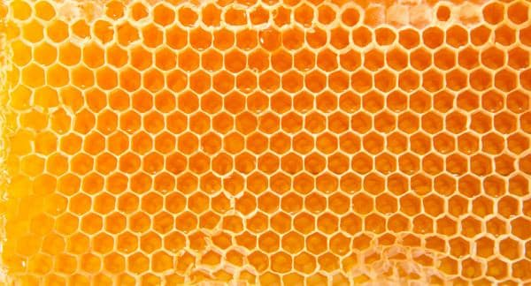
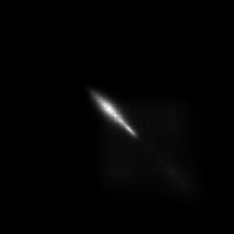

# Лабораторная работа №7

### Тема: Текстурный анализ

|**Студент:**|*Долидзе Александра*|
|------------|--------------|
|**Группа:** |*Б18-514*     |
|**Вариант**|*3*|
---
## Пример №1
### Исходное изображение

### Матрица Харалика

- ASM: 7.307987006258605e-05
- MPR: 0.00017349063150589867
- ENT: 14.0926389589199
- TR: 0.015243615116388654
---
## Пример №2
### Исходное изображение

### Матрица Харалика

- ASM: 8.463707412744162e-05
- MPR: 0.00019072751371040263
- ENT: 13.946827484645546
- TR: 0.016705793124720147
---
## Пример №3
### Исходное изображение

### Матрица Харалика

- ASM: 0.00015920188413654038
- MPR: 0.0013807610366494971
- ENT: 13.353101208970722
- TR: 0.022566813192740218
---
## Пример №4
### Исходное изображение

### Матрица Харалика

- ASM: 0.000897143771211119
- MPR: 0.002486982202533613
- ENT: 10.724354586947126
- TR: 0.05045853734359213

---
## Пример №5
### Исходное изображение

### Матрица Харалика

- ASM: 6.733157782517585e-05
- MPR: 0.0001637589851548642
- ENT: 14.265195334863039
- TR: 0.00874895171860577
---
## Пример №6
### Исходное изображение

### Матрица Харалика

- ASM: 0.0018647435601625057
- MPR: 0.0113439978730004
- ENT: 10.6073454226018
- TR: 0.23405858111401598
---
## Пример №7
### Исходное изображение

### Матрица Харалика

- ASM: 0.0003683110351441098
- MPR: 0.001290914683650263
- ENT: 12.550540235509612
- TR: 0.046452758069477434

