# Лабораторная работа №7

### Тема: Текстурный анализ

|**Студент:**|*Долидзе Александра*|
|------------|--------------|
|**Группа:** |*Б18-514*     |
|**Вариант**|*3*|

####  Задание: Сравнить вид матрицы и признаки для разных изображений
```
d = 3
phi = {0, 90, 180, 270}
```
#### Признаки: 
- Энергия ASM
- Максимальная вероятность MPR 
- Энтропия ENT
- След TR
--- 
### Пример №1
#### Исходное изображение

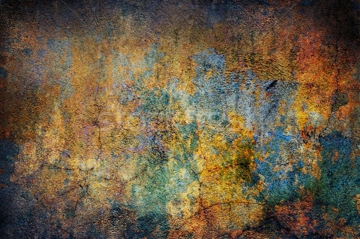

### Матрица Харалика

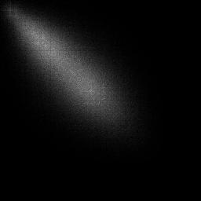


### Исходное изображение

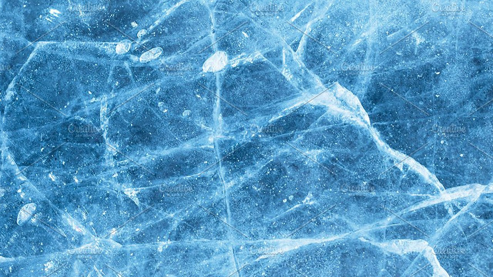

### Матрица Харалика

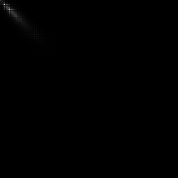

corr: 0.919543905843358


### Исходное изображение

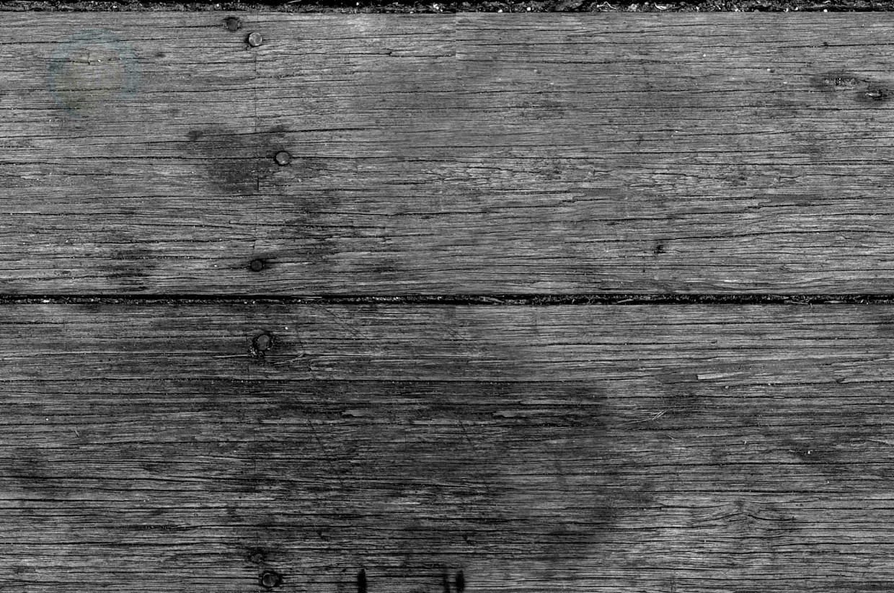

### Матрица Харалика

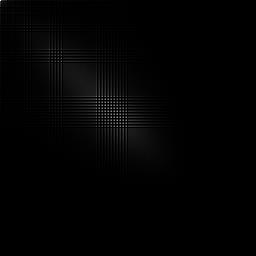

corr: 0.8724240695431034


### Исходное изображение

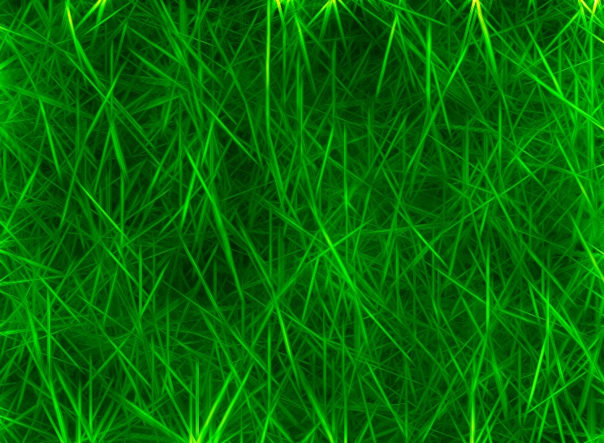

### Матрица Харалика

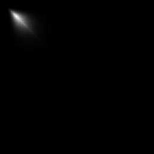

corr: 0.9751296320303545


### Исходное изображение

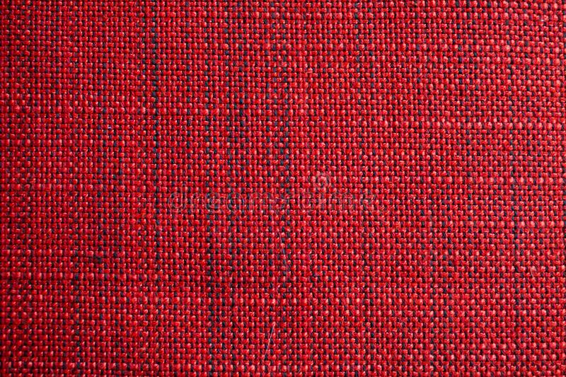

### Матрица Харалика

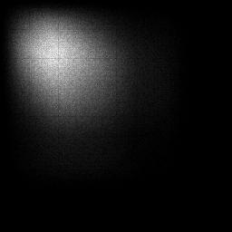

corr: 0.9366067353251917


### Исходное изображение


### Матрица Харалика

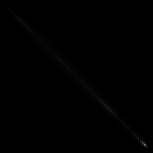

corr: 0.9959474930883142


