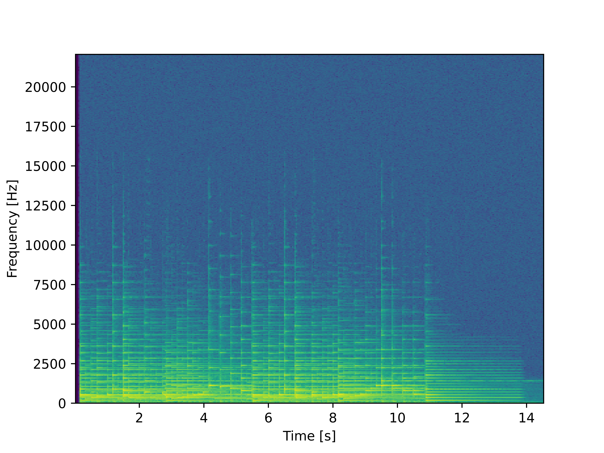

# Лабораторная работа №9

### Тема: Обработка звуковой информации

|**Студент:**|*Долидзе Александра*|
|------------|--------------|
|**Группа:** |*Б18-514*     |

---

### Задание №1: Построить спектрограмму и сохранить в файл, пользуясь оконным преобразованием Фурье с окном Ханна

- Для записи голоса:

  
- Для записи инструмента:
